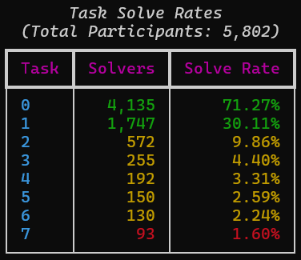

# Introduction

 
Scraper credit to: https://github.com/code-zm/cbc_scraper

# Write-Ups

| Task          | Name                      | Skills                                |
|:-------------:|:-------------------------:|:-------------------------------------:|
| [0](task0/)   | -                         | Community of Practice, Discord Server |
| [1](task1/)   | Getting Started           | Forensics                             |
| [2](task2/)   | The hunt continues        | Network Forensics                     |
| [3](task3/)   | Digging deeper            | Reverse Engineering                   |
| [4](task4/)   | Unpacking Insight         | Malware Analysis                      |
| [5](task5/)   | Putting it all together   | Cryptanalysis                         |
| [6](task6/)   | Crossing the Channel      | Vulnerability Research                |
| [7](task7/)   | Finale                    | Vulnerability Research, Exploitation  |

# Overview
>The Codebreaker Challenge consists of a series of tasks that are worth a varying number of points based upon their difficulty. Schools will be ranked according to the total number of points accumulated by their students.
>
>Solutions may be submitted at any time for the duration of the Challenge.
>
>This year the tasks are strictly sequential, and one must be solved before the next one becomes available.
>
>Each task in this year's challenge will require a range of skills. We need you to call upon all of your technical expertise, your intuition, and your common sense.
>
>Good luck. We hope you enjoy the challenge!

# Background
>The Air Force's Cyber Operations Squadron is well known for developing tools to ensure the cyber dominance of the United States military. Advanced foreign adversary's, attempting to gather intelligence as well as bolster their own cyber arsenal, are always searching for ways to infiltrate, sabotage, and steal.
>
>While the defenses in our military networks are robust, they are not impervious and continued vigilance and overwatch are a necessity. Yesterday, one savvy Department of the Air Force Security Operation Center (DAFIN-SOC) analyst noticed unusual behavior and reached out to the 616 Operations Center, and submitted a Request for Information (RFI) to the NSA for assistance.
>
>You have just begun the first tour in your Development Program at NSA with the Cyber Response Team and are looking to make a big impact. You have always read about the threat of Nation-State Advanced Persistent Threats but now you have a chance to personally defend American interests against a sophisticated and capable adversary. 

# Disclaimer
>The challenge content is a PURELY FICTIONAL SCENARIO created by the NSA for EDUCATIONAL PURPOSES only. The mention and use of any actual products, tools, and techniques are similarly contrived for the sake of the challenge alone, and do not represent the intent of any company, product owner, or standards body.
>
>Any similarities to real persons, entities, or events is coincidental. 

