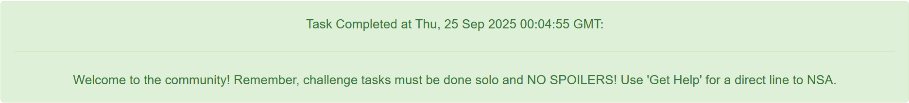

# Task 0 - (Community of Practice, Discord Server)

As a participant in the Codebreaker Challenge, you are invited to join the New Mexico Tech Codebreaker Challenge Community of Practice! This is the 4th year that NMT has partnered with the NSA Codebreaker Challenge. Its purpose remains to give students interested in cybersecurity a place to talk about Codebreaker, cybersecurity, and other related topics.

To complete this task, first, join the Discord server. https://discord.gg/SWYCM5xr4N

Once there, type `/task0` in the `#bot-commands` channel. Follow the prompts and paste the answer the bot gives you below.

Note: You must provide the bot with the email you used to register for the Challenge and the following token: `REDACTED`

## Prompt

    Provide the answer the bot gives you

## Solution

This task simply required creating and/or registering for the Discord server using the token provided. 

## Result

