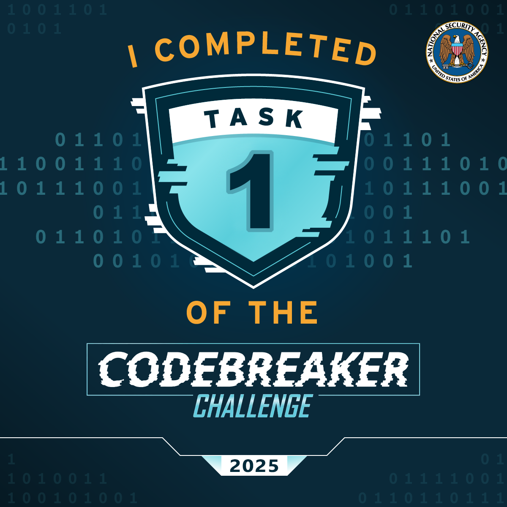

# Task 1 - Getting Started - (Forensics)

You arrive on site and immediately get to work. The DAFIN-SOC team quickly briefs you on the situation. They have noticed numerous anomalous behaviors, such as; tools randomly failing tests and anti-virus flagging on seemingly clean workstations. They have narrowed in on one machine they would like NSA to thoroughly evaluate.

They have provided a zipped EXT2 image from this development machine. Help DAFIN-SOC perform a forensic analysis on this - looking for any suspicious artifacts.

## Downloads:

  - [zipped EXT2 image (image.ext2.zip)](Downloads/image.ext2.zip)

## Prompt:

    Provide the SHA-1 hash of the suspicious artifact.

Task Completed at Thu, 25 Sep 2025 00:50:39 GMT: 

---

Great job finding that artifact! Let's report what we found to DAFIN-SOC leadership.

---

