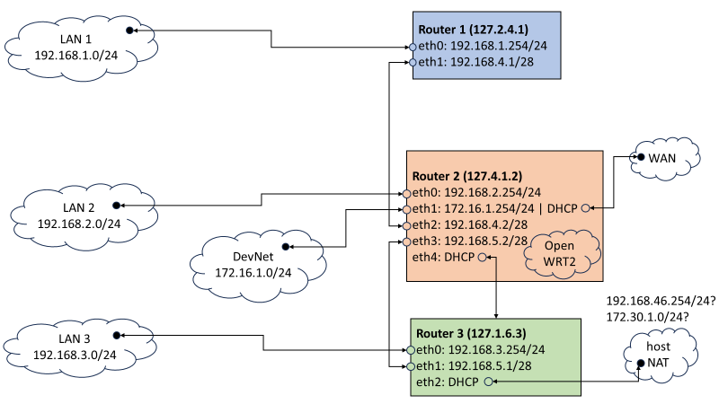

# Task 2 - The hunt continues - (Network Forensics)

With your help, the team concludes that there was clearly a sophisticated piece of malware installed on that endpoint that was generating some network traffic. Fortunately, DAFIN-SOC also has an IDS which retained the recent network traffic in this segment.

DAFIN-SOC has provided a PCAP to analyze. Thoroughly evaluate the PCAP to identify potential malicious activity.


## Downloads

  - [PCAP to analyze (traffic.pcap)](Downloads/traffic.pcap)

## Prompt

    Submit all the IP addresses that are assigned to the malicious device, one per line

## Solution

Opening up the given PCAP in Wireshark, there is much to look at. 

Using `Statistics > Conversations` and then selecting one of the tabs allows following a specific stream ID. Sort by Stream ID and then right click on each row to select `Apply as Filter > Selected > Filter on stream id` to more easily interpret the comunication hapenning between addresses. I took the following notes on suspicious IPv4 stream IDs during my solve:
```
Suspicious IPv4 streams
 2: 192.168.1.140, 172.30.1.5     (list/test FTP files)
18: 172.30.1.230 , 192.168.1.254  (ssh)
21: 172.30.1.5   , 192.168.4.1    (router 1 backup)
23: 172.30.1.230 , 192.168.3.254  (ssh)
27: 192.168.5.1  , 170.30.1.5     (router 3 backup)
31: downloading binaries? But from Ubuntu repos...
33: 172.30.1.230 , 192.168.2.254  (ssh)
34: 192.168.3.89 , 203.0.113.108  (public key sent)
35: 172.30.1.5   , 172.30.1.254   (router 2 backup)
```

### Stream 2
This stream contains a listing of all of the files available on the FTP server:
```sh
-rw-r--r--    1 122      124          9856 Aug 29 14:44 RFC2549.txt
-rw-------    1 122      124           808 Aug 29 13:59 router1_backup.config
-rw-------    1 122      124          1339 Aug 29 14:05 router2_backup.config
-rw-------    1 122      124           842 Aug 29 14:06 router3_backup.config
-rw-------    1 122      124             0 Aug 29 13:51 test.txt
```

Additionally, selecting `File > Export Objects > FTP-DATA` reveals that `RFC2549` ([IP over Avian Carriers](https://en.wikipedia.org/wiki/IP_over_Avian_Carriers)) has been sent over the network via FTP, presumably as an Easter Egg for us to find.

### Stream 31
Selecting `File > Export Objects > HTTP` shows that two Ubuntu packages have been downloaded from `archive.ubuntu.com`. But, they are from a legitimate package repository, so not immediately indicative of malicious behavior:
```
libavahi-gobject0_0.8-13ubuntu6_amd64.deb
spice-webdavd_3.0-9_amd64.deb
```

### Stream 35
During the challenge, I thought these references to `0xdec0dec0ffee` must surely indicate that I was close to the answer:
```
2337:
dec0dec0ffee
-----BEGIN PUBLIC KEY-----
MIIBIjANBgkqhkiG9w0BAQEFAAOCAQ8AMIIBCgKCAQEAx3Gp23tmyukfcyJqkImm
MfA98r4MBy/Qso1Zz7wB82ooE/rIMiWSQjMCH1ph4cCwGii5UKckNhYxUH38sfs1
nnyAGXY9cCtloPPbTvlUI1wrvESigPWH6q5tcQGlHretil4tU94Fy3xVD9p+dhm1
CDM8HcpVRVfqDHEd/pBpY49TGZohVkun9RW8VFO9XeSnPccPExIfZhnf1tSI3cMh
CeuMXl8ZrBoyqT3VpVntJ0KdyZV/K4G/mbDnkRHIwLrDeQGd8Mm/7XDqIXvvnMPa
PclZd95mT4Yo+6LOBu6VB74RSh5eTPsygYDexwxHjBtsJYOZciUnlyRauj67NfLW
SwIDAQAB
-----END PUBLIC KEY-----

2339:
dec0dec0ffee34c68c6dceeba98a1efb6a62aa61046e9bf52f21d12d0aed2cf639b7d2ac49aeb404c50634377008e21b5fe747b05fd3d47f7bbdc4eb3cd5589befbf6c3f460367b5b50ab9996af382bceebef5236dbf9e184e3cccfc9d209556a00d011e3471c442093abee35280196c339d2ecb5643a3e13b83f7eb80c6f9c0eb73d9b96a1b3a6e6b44262c890c641a8096dc31621c139457ee3261574146dccf30b7fd2eeafb3530fd45dc576e89c3b04abde40930941a1d22b4c0204345fb52696b4a9868963689fcbfe455d26349752d2200f9a98946bec42a6b6f4692d4ceb149132aaadced77f09f39bf0effdaf3e963d85508092c9b2f6f851bfd791400cd7b87708b

2340:
dec0dec0ffee
KEY_RECEIVED
```

### Streams 21, 27, 35
These streams contained plaintext backups of three router backup configurations:

#### Router 1 Config
```
config interface 'loopback'
	option device 'lo'
	option proto 'static'
	option ipaddr '127.2.4.1'
	option netmask '255.0.0.0'

config globals 'globals'
	option ula_prefix 'fd10:95e0:f1b::/48'
	option packet_steering '1'

config device
	option name 'br-lan'
	option type 'bridge'
	list ports 'eth0'

config interface 'lan'
	option device 'br-lan'
	option proto 'static'
	option ipaddr '192.168.1.254'
	option netmask '255.255.255.0'
	option ip6assign '60'

config interface 'to_devnet'
	option proto 'static'
	option device 'eth1'
	option ipaddr '192.168.4.1'
	option netmask '255.255.255.240'

config route
	option interface 'lan'
	option target '192.168.1.0/24'
	option gateway '192.168.1.254'

config route 'to_lan2'
	option target '0.0.0.0/0'
	option gateway '192.168.4.2'
	option interface 'to_devnet'
```

#### Router 2 Config
```
config interface 'loopback'
	option device 'lo'
	option proto 'static'
	option ipaddr '127.4.1.2'
	option netmask '255.0.0.0'

config globals 'globals'
	option ula_prefix 'fd45:7f60:3ad5::/48'
	option packet_steering '1'

config device
	option name 'br-lan'
	option type 'bridge'
	list ports 'eth0'

config interface 'lan'
	option device 'br-lan'
	option proto 'static'
	option ipaddr '192.168.2.254'
	option netmask '255.255.255.0'

config interface 'wan'
	option device 'eth1'
	option proto 'dhcp'

config interface 'to_devnet'
	option proto 'static'
	option device 'eth1'
	list ipaddr '172.16.1.254/24'

config interface 'to_lan1'
	option proto 'static'
	option device 'eth2'
	list ipaddr '192.168.4.2/28'

config interface 'to_lan3'
	option proto 'static'
	option device 'eth3'
	list ipaddr '192.168.5.2/28'

config interface 'to_host_nat'
	option proto 'dhcp'
	option device 'eth4'

config route 'route_to_devnet'
	option interface 'to_devnet'
	option target '172.16.1.0/24'
	option gateway '172.16.1.254'

config route
	option interface 'lan'
	option target '192.168.2.0/24'
	option gateway '192.168.2.254'

config route 'route_to_lan1'
	option target '192.168.1.0/24'
	option gateway '192.168.4.1'
	option interface 'to_lan1'

config route
	option target '192.168.3.0/24'
	option gateway '192.168.5.1'
	option interface 'to_lan3'
```

#### Router 3 Config
```
config interface 'loopback'
	option device 'lo'
	option proto 'static'
	option ipaddr '127.1.6.3'
	option netmask '255.0.0.0'

config globals 'globals'
	option ula_prefix 'fdf2:87c7:eb73::/48'
	option packet_steering '1'

config device
	option name 'br-lan'
	option type 'bridge'
	list ports 'eth0'

config interface 'lan'
	option device 'br-lan'
	option proto 'static'
	option ipaddr '192.168.3.254'
	option netmask '255.255.255.0'
	option ip6assign '60'

config interface 'to_openwrt2'
	option device 'eth1'
	option proto 'static'
	list ipaddr '192.168.5.1/28'

config interface 'host_nat'
	option proto 'dhcp'
	option device 'eth2'

config route
	option target '192.168.3.0/24'
	option gateway '192.168.3.254'
	option interface 'lan'

config route
	option target '0.0.0.0/0'
	option gateway '192.168.5.2'
	option interface 'to_openwrt2'
```

I attempted using LLMs to map the network diagram based on these router configurations, which was marginally useful, until I finally sat down and made the following diagram by hand:



The solution came to me when I questioned why IP `192.168.46.2` kept ARPing `192.168.2.50` without response. I tried submitting the IPs for router 2 and then had the idea to try router 3 next, which was finally the answer.

Router 3 IP addresses (including loopback)
```
127.1.6.3
192.168.3.254
192.168.5.1
```

### Notes

Like many, I got stuck on this task looking for a needle in a haystack. I spent several nights poring over Wireshark and eventually started logging my submission attempts to avoid insanity. 

In the end, staring at the PCAP for so long proved useful later when it was required again for task 5. I thought at the time that `0xdec0dec0ffee` must surely indicate the answer for task 2 and was perplexed that is was not.

In hindsight, I could have recognized from task 1 that the suspicious machine was running Alpine Linux, an unlikely scenario for a development machine, but very likely for a router.

I believe the correct way to solve this task was to find packet #2025 (coincidence?):
```python
Source:      192.168.3.254:53  
Destination: 192.168.3.229:37197	
Protocol:    DNS	
Info:        Standard query response 0xc0c1 A archive.ubuntu.com A 203.0.113.108 OPT
```

This shows compromised router 3 replying to a DNS query with an IP address (`203.0.113.108`) in the TEST-NET-3 block of reserved IP addresses. Shortly thereafter, a connection is made with public RSA key exchange to `203.0.113.108`.

## Result

<div align="center" 
     style="background-color: #dff0d8;
            border-color: #d6e9c6;
            color: #3c763d;
            padding: 15px;
            border-radius: 4px;
            font-family: Roboto, Helvetica, Arial, sans-serif;
            font-size: 14px;
            line-height: 1.42857143;">
Task Completed at Tue, 30 Sep 2025 04:15:49 GMT: 

---

Excellent work identifying the suspicious network traffic and narrowing in on the source! We will head over to the network administrators to discuss what we have discovered.

</div>

---

<div align="center">


</div>