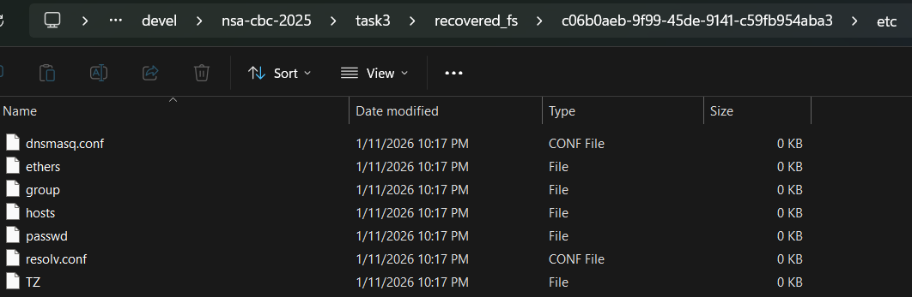
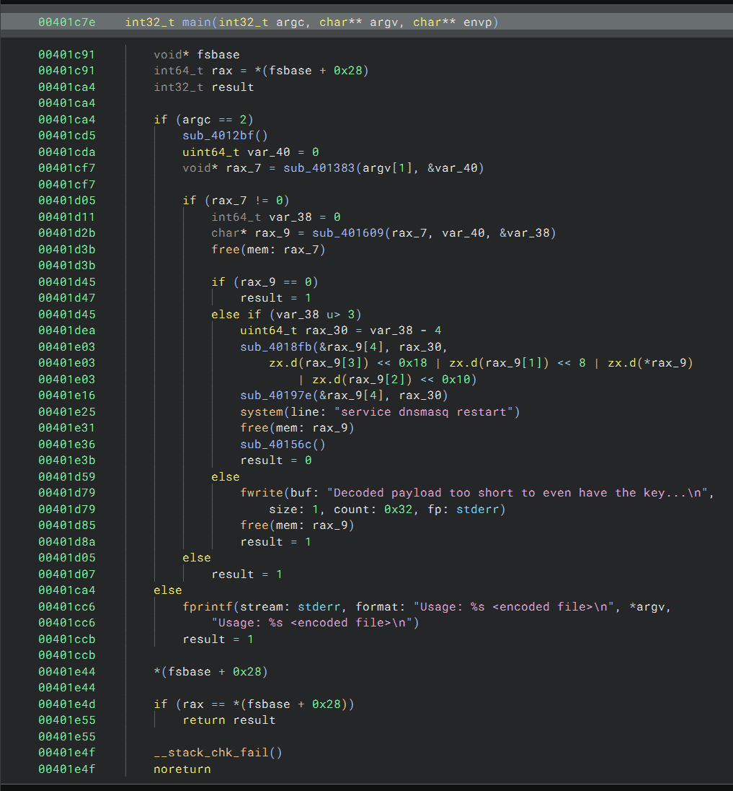
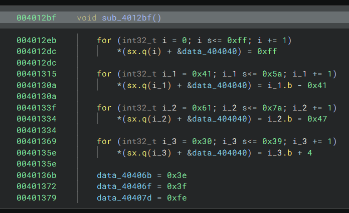

# Task 3 - Digging deeper - (Reverse Engineering)

The network administrators confirm that the IP address you provided in your description is an edge router. DAFIN-SOC is asking you to dive deeper and reverse engineer this device. Fortunately, their team managed to pull a memory dump of the device.

Scour the device's memory dump and identify anomalous or malicious activity to find out what's going on.

Your submission will be a list of IPs and domains, one per line. For example:
```
127.0.0.1 localhost
192.168.54.131 corp.internal
```
...
</span>


## Downloads

  - [Memory Dump (memory.dump.gz)](Downloads/memory.dump.gz)
  - [Metadata (System.map.br)](Downloads/System.map.br)
  - [Kernel Image (vmlinux.xz)](Downloads/vmlinux.xz)

## Prompt

    Submit a complete list of affected IPs and FQDNs, one per line.

## Solution

The first step necessary is to extract each of the source files. Use `7zip` on Windows for the `.gz` and `.xz` files. Install brotli on WSL Ubuntu and use that to extract the `.br` file. Now the list of extracted downloaded files is:
```
Memory Dump (memory.dump)
Metadata (System.map)
Kernel Image (vmlinux)
```

### Tooling

We are given a memory dump along with the associated Linux kernel `vmlinux` and `System.map` symbol table, which indicate using a specialty tool, such as the open-source [Volatility 3](https://github.com/volatilityfoundation/volatility3) framework. This folder contains `pixi.toml` and `pixi.lock` files suitable for installing Volatility 3 and other Python tools using [pixi](https://pixi.prefix.dev/latest/) package manager. Run `pixi shell` to activate the environment and download the tools for the first time.

We need a symbol table to use Volatility 3 and this can be generated from the given kernel image and system map. To generate the symbol table, use [dwarf2json](https://github.com/volatilityfoundation/dwarf2json). Clone and build this tool using:
```
git clone https://github.com/volatilityfoundation/dwarf2json.git
cd dwarf2json
go build
```

Then generate the symbol map using `./dwarf2json linux --elf vmlinux --system-map system.map > symbols_dwarf2json.json`

Alternatively, I also used [btf2json](https://github.com/vobst/btf2json) with success after patching one line of the output compared to `dwarf2json`. This symbol table also allowed me to successfully run the Volatility `linux.capabilities` tool, which failed with `dwarf2json`. This additional capability did not prove helpful, but was interesting nonetheless. Volatility will pull symbols from all available files by default. Both of these symbol outputs are included in the [symbols/](symbols/) folder and referenced in the commands given below.

Other tools I attempted to use for this task were [Binwalk](https://github.com/ReFirmLabs/binwalk) and [bulk_extractor](https://github.com/simsong/bulk_extractor). 

### Exploration

Now that our tooling is setup, we can begin frantically running every available built-in Volatility plugin until something makes sense. Here is the logical retrospective of that process. For Volatility commands `-r pretty` and `-r csv` can be used to render the output in a more readable format or save to file for easier parsing.

Running `vol -f ./memory.dump --symbol-dirs=./symbols banners` confirms the story from tasks 1 and 2 that our suspicious device is a resource constrained router running [OpenWRT](https://openwrt.org/) and using the [musl](https://musl.libc.org/) implementation of the C standard library.
```
|   Offset  |   Banner
|  0x4280af | Linux version 5.15.134 (dsu@Ubuntu) (x86_64-openwrt-linux-musl-gcc (OpenWrt GCC 12.3.0 r23497-6637af95aa) 12.3.0, GNU ld (GNU Binutils) 2.40.0) #0 SMP Mon Oct 9 21:45:35 2023
| 0x2000220 | Linux version 5.15.134 (dsu@Ubuntu) (x86_64-openwrt-linux-musl-gcc (OpenWrt GCC 12.3.0 r23497-6637af95aa) 12.3.0, GNU ld (GNU Binutils) 2.40.0) #0 SMP Mon Oct 9 21:45:35 2023
| 0x2d93258 | Linux version 5.15.134 (dsu@Ubuntu) (x86_64-openwrt-linux-musl-gcc (OpenWrt GCC 12.3.0 r23497-6637af95aa) 12.3.0, GNU ld (GNU Binutils) 2.40.0) #0 SMP Mon Oct 9 21:45:35 202323
```


`vol -f ./memory.dump --symbol-dirs=./symbols linux.pagecache.Files` lists all files on the filesystem and their paths along with other information about their state and storage locations. Some potential candidates for files that IP addresses might be stored include
```
/etc/hosts
/tmp/hosts
/tmp/dhcp.leases
```

We can find information on specific files using the `--find` flag:

`vol -f ./memory.dump --symbol-dirs=./symbols -r pretty linux.pagecache.Files --find /etc/hosts`
```
| SuperblockAddr | MountPoint | Device | InodeNum |      InodeAddr | FileType | InodePages | CachedPages |   FileMode |                     AccessTime |               ModificationTime |                     ChangeTime |   FilePath | InodeSize
| 0x88800570d000 |          / |  254:0 |       98 | 0x888005c011e8 |      REG |          1 |           1 | -rw-rw-r-- | 2023-10-09 21:45:35.000000 UTC | 2025-09-06 04:54:16.520000 UTC | 2025-09-06 04:54:16.520000 UTC | /etc/hosts |      1330
```

`vol -f ./memory.dump --symbol-dirs=./symbols -r pretty linux.pagecache.Files --find /tmp/hosts`
```
| SuperblockAddr | MountPoint | Device | InodeNum |      InodeAddr | FileType | InodePages | CachedPages |   FileMode |                     AccessTime |               ModificationTime |                     ChangeTime |   FilePath | InodeSize
| 0x88800580d000 |       /tmp |   0:20 |       41 | 0x888003274478 |      DIR |          1 |           0 | drwxr-xr-x | 2025-09-06 04:53:54.250000 UTC | 2025-09-06 04:53:55.340000 UTC | 2025-09-06 04:53:55.340000 UTC | /tmp/hosts |        60
```
`vol -f ./memory.dump --symbol-dirs=./symbols -r pretty linux.pagecache.Files --find /tmp/dhcp.leases`
```
| SuperblockAddr | MountPoint | Device | InodeNum |      InodeAddr | FileType | InodePages | CachedPages |   FileMode |                     AccessTime |               ModificationTime |                     ChangeTime |         FilePath | InodeSize
| 0x88800580d000 |       /tmp |   0:20 |       46 | 0x8880032770d0 |      REG |          0 |           0 | -rw-r--r-- | 2025-09-06 04:53:54.890000 UTC | 2025-09-06 04:53:54.890000 UTC | 2025-09-06 04:53:54.890000 UTC | /tmp/dhcp.leases |         0
```

To dump the filesystem, use the command `vol -f ./memory.dump --symbol-dirs=./symbols linux.pagecache.RecoverFs`. This outputs a tarball of the recovered filesystem. Add the `--tmpfs-only` flag to only output the files from the tmpfs filesystem. Unfortunately, both of these options output only the folder structures with empty files.



We attempt to dump the files directly using `vol -f ./memory.dump --symbol-dirs=./symbols linux.pagecache.InodePages --find /etc/hosts` or `vol -f ./memory.dump --symbol-dirs=./symbols linux.pagecache.InodePages --inode 0x888005c011e8` but it seems that the page cache has been corrupted for this memory dump.
```
PageVAddr       PagePAddr       MappingAddr     Index   DumpSafe        Flags   Output File
ERROR    volatility3.framework.symbols.linux: Invalid cached page at 0x888007c14a40, aborting
WARNING  volatility3.plugins.linux.pagecache: Page cache for inode at 0x888005c011e8 is corrupt
```

So, we dig deeper and try to learn more about what led up to this memory dump. Many of the Volatility plugins return similar information which leads to a lot to sift through. The command `vol -f ./memory.dump --symbol-dirs=./symbols -r pretty linux.pstree` returns each running process ID (PID) with information on the parent PIDs. From this we can see that their are two top level processes:
```
      |     OFFSET (V) |  PID |  TID | PPID |            COMM
*     | 0x88800329cb40 |    1 |    1 |    0 |           procd
*     | 0x88800329e940 |    2 |    2 |    0 |        kthreadd
```

After a sufficient amount of staring, we come to the conclusion that `kthreadd` and its descendants are innocuous and the more interesting tree is under `procd`:
```
      |     OFFSET (V) |  PID |  TID | PPID |            COMM
*     | 0x88800329cb40 |    1 |    1 |    0 |           procd
**    | 0x88800534da40 |  514 |  514 |    1 |           ubusd
**    | 0x88800534bc40 |  515 |  515 |    1 |             ash
***   | 0x888003edad40 | 1552 | 1552 |  515 |               4
****  | 0x8880063c0040 | 1854 | 1854 | 1552 |         service
***** | 0x8880063c2d40 | 1855 | 1855 | 1854 |         dnsmasq
**    | 0x888005349e40 |  516 |  516 |    1 |        askfirst
**    | 0x888003edbc40 |  551 |  551 |    1 |           urngd
**    | 0x88800631da40 | 1018 | 1018 |    1 |            logd
**    | 0x8880067f9e40 | 1168 | 1168 |    1 |         dnsmasq
***   | 0x8880067f8040 | 1174 | 1174 | 1168 |         dnsmasq
**    | 0x8880063c1e40 | 1244 | 1244 |    1 |        dropbear
**    | 0x888003f20040 | 1405 | 1405 |    1 |          netifd
**    | 0x88800631ad40 | 1524 | 1524 |    1 |          odhcpd
**    | 0x8880067f8f40 | 1744 | 1744 |    1 |            ntpd
***   | 0x8880057acb40 | 1749 | 1749 | 1744 |            ntpd
```

Helpful in this determination is the command `vol -f ./memory.dump --symbol-dirs=./symbols linux.psaux.PsAux` that lists the command line arguments that each PID is run with. Here are the two parent processes and the children of `procd`:
```
PID	    PPID    COMM         ARGS
1       0       procd        /sbin/procd
2       0       kthreadd     [kthreadd]
514     1       ubusd        /sbin/ubusd
515     1       ash          /bin/ash --login
516     1       askfirst     /sbin/askfirst /usr/libexec/login.sh
551     1       urngd        /sbin/urngd
1018    1       logd         /sbin/logd -S 64
1168    1       dnsmasq      /sbin/ujail -t 5 -n dnsmasq -u -l -r /bin/ubus -r /etc/TZ -r /etc/dnsmasq.conf -r /etc/ethers -r /etc/group -r /etc/hosts -r /etc/passwd -w /tmp/dhcp.leases -r /tmp/dnsmasq.d -r /tmp/hosts -r /tmp/resolv.conf.d -r /usr/bin/jshn -r /usr/lib/dnsmasq/dhcp-script.sh -r /usr/share/dnsmasq/dhcpbogushostname.conf -r /usr/share/dnsmasq/rfc6761.conf -r /usr/share/dnsmasq/trust-anchors.conf -r /usr/share/libubox/jshn.sh -r /var/etc/dnsmasq.conf.cfg01411c -w /var/run/dnsmasq/ -- /usr/sbin/dnsmasq -C /var/etc/dnsmasq.conf.cfg01411c -k -x /var/run/dnsmasq/dnsmasq.cfg01411c.pid

1174    1168    dnsmasq      /usr/sbin/dnsmasq -C /var/etc/dnsmasq.conf.cfg01411c -k -x /var/run/dnsmasq/dnsmasq.cfg01411c.pid
1244    1       dropbear     /usr/sbin/dropbear -F -P /var/run/dropbear.1.pid -p 22 -K 300 -T 3
1405    1       netifd       /sbin/netifd
1524    1       odhcpd       /usr/sbin/odhcpd
1552    515     4            /bin/libnss-update /proc/self/fd/5
1744    1       ntpd         /sbin/ujail -t 5 -n ntpd -U ntp -G ntp -C /etc/capabilities/ntpd.json -c -u -r /bin/ubus -r /usr/bin/env -r /usr/bin/jshn -r /usr/sbin/ntpd-hotplug -r /usr/share/libubox/jshn.sh -- /usr/sbin/ntpd -n -N -S /usr/sbin/ntpd-hotplug -p 0.openwrt.pool.ntp.org -p 1.openwrt.pool.ntp.org -p 2.openwrt.pool.ntp.org -p 3.openwrt.pool.ntp.org

1749    1744    ntpd         /usr/sbin/ntpd -n -N -S /usr/sbin/ntpd-hotplug -p 0.openwrt.pool.ntp.org -p 1.openwrt.pool.ntp.org -p 2.openwrt.pool.ntp.org -p 3.openwrt.pool.ntp.org
1854    1552    service      /bin/sh /sbin/service dnsmasq restart
1855    1854    dnsmasq      /bin/sh /etc/rc.common /etc/init.d/dnsmasq restart
```

It is clear that the command line arguments are meaningful (none of the `kthreadd` descendants have any ARGS). PID 1552 is named `4`, which is odd. The parent process is 515, the [ash shell](https://en.wikipedia.org/wiki/Almquist_shell), which indicates that this was a process perhaps called by a user. The child PID, 1854, restarts [dnsmasq](https://thekelleys.org.uk/dnsmasq/doc.html) after it is already running. We know that DNS entries have been modified as seen in the task 2 PCAP. Isolating this progressing allows us to see the attack unfolding via PID:
```
PID	    PPID    COMM         ARGS
515     1       ash          /bin/ash --login
1552    515     4            /bin/libnss-update /proc/self/fd/5
1854    1552    service      /bin/sh /sbin/service dnsmasq restart
1855    1854    dnsmasq      /bin/sh /etc/rc.common /etc/init.d/dnsmasq restart
```

We conjecture that PID 1552 is malicious and restrict our investigation to finding the program `/bin/libnss-update` and argument `/proc/self/fd/5`. Interestingly, neither of these files can be found within the filesystem using `linux.pagecache.Files`. However, opening `memory.dump` in [VS Code](https://code.visualstudio.com/) and searching for `/proc/self/fd/5` yields the following plaintext that seems to show `ash` opening ([no root password](https://router-network.com/default-router-passwords-list)???!!!) and the malicious program running with `/proc/self/fd/5` as a configuration file, right before opening `/etc/hosts`!! 
```
BusyBox v1.36.1 (2023-10-09 21:45:35 UTC) built-in shell (ash)

  _______                     ________        __
 |       |.-----.-----.-----.|  |  |  |.----.|  |_
 |   -   ||  _  |  -__|     ||  |  |  ||   _||   _|
 |_______||   __|_____|__|__||________||__|  |____|
          |__| W I R E L E S S   F R E E D O M
 -----------------------------------------------------
 OpenWrt 23.05.0, r23497-6637af95aa
 -----------------------------------------------------
=== WARNING! =====================================
There is no root password defined on this device!
Use the "passwd" command to set up a new password
in order to prevent unauthorized SSH logins.
--------------------------------------------------
root@OpenWrt:/# unset HISTFILE
root@OpenWrt:/# /bin/sh


BusyBox v1.36.1 (2023-10-09 21:45:35 UTC) built-in shell (ash)

root@OpenWrt:/# unset HISTFILE
root@OpenWrt:/# mkdir /tmp/run/upt && mount -t 9p -o trans=virtio,version=9p2000.L,cache=none KNL /tmp/run/upt && cp /tmp/run/upt/arm /bin/ && umount /tmp/run/upt && exit
root@OpenWrt:/# /bin/arm 2>&1 /dev/null
cfg file: /proc/self/fd/5
opening /proc/self/fd/5
opened /proc/self/fd/5
opening /etc/hosts
```

This is evidence we need! Also to be found in the memory dump is the following list of strings, interspersed with non-ascii characters:
```
opening %s
fopen
opened %s
fseek
ftell
malloc
fread
malloc tok
realloc tok
opening /etc/hosts
Usage: %s <encoded file>
Decoded payload too short to even have the key...
service dnsmasq restart
```

We now need to find the contents of the malicious program and config file. Start by dumping all ELFs from the malicious process using `vol -f ./memory.dump --symbol-dirs=./symbols -r pretty linux.elfs --pid 1552 --dump`. [libc](https://man7.org/linux/man-pages/man7/libc.7.html) and [vdso](https://man7.org/linux/man-pages/man7/vdso.7.html) are not interesting, but the deleted file is!
```
  |  PID | Process |          Start |            End |          File Path |                   File Output
* | 1552 |       4 | 0x564595660000 | 0x564595661000 | /memfd:x (deleted) | pid.1552.4.0x564595660000.dmp
* | 1552 |       4 | 0x7f3b2d6ed000 | 0x7f3b2d701000 |       /lib/libc.so | pid.1552.4.0x7f3b2d6ed000.dmp
* | 1552 |       4 | 0x7fffbdf79000 | 0x7fffbdf7a000 |             [vdso] | pid.1552.4.0x7fffbdf79000.dmp
```

Opening `pid.1552.4.0x564595660000.dmp` in [Binary Ninja](https://binary.ninja/) (Binja) shows some of the above strings in `main()`



The first function called in main(), `sub_4012bf()` is shown below and sets up a custom base64 to ascii lookup table. The first for loop clears the table stored at `&data_404040`. The second for loop adds capital ASCII letters. The third loop sets lowercase ASCII letters. The fourth loop initializes numbers (offset by 4). The last assignments set '+', '/', and '='. Based on this information, we might be looking for base64 encoded data somewhere in the memory dump.



By dumping the memory maps for the malicious PID, we can see the content of the deleted file.
`vol -f ./memory.dump --symbol-dirs=./symbols -r pretty linux.proc.Maps --pid 1552 --dump`
```
  |  PID | Process |          Start |            End | Flags |   PgOff | Major | Minor | Inode |          File Path |                                    File output
* | 1552 |       4 | 0x564595660000 | 0x564595661000 |   r-- |     0x0 |     0 |     1 |     3 | /memfd:x (deleted) | pid.1552.vma.0x564595660000-0x564595661000.dmp
* | 1552 |       4 | 0x564595661000 | 0x564595662000 |   r-x |  0x1000 |     0 |     1 |     3 | /memfd:x (deleted) | pid.1552.vma.0x564595661000-0x564595662000.dmp
* | 1552 |       4 | 0x564595662000 | 0x564595663000 |   r-- |  0x2000 |     0 |     1 |     3 | /memfd:x (deleted) | pid.1552.vma.0x564595662000-0x564595663000.dmp
* | 1552 |       4 | 0x564595663000 | 0x564595664000 |   r-- |  0x2000 |     0 |     1 |     3 | /memfd:x (deleted) | pid.1552.vma.0x564595663000-0x564595664000.dmp
* | 1552 |       4 | 0x564595664000 | 0x564595665000 |   rw- |  0x3000 |     0 |     1 |     3 | /memfd:x (deleted) | pid.1552.vma.0x564595664000-0x564595665000.dmp
* | 1552 |       4 | 0x56459632f000 | 0x564596330000 |   --- |     0x0 |     0 |     0 |     0 |  Anonymous Mapping | pid.1552.vma.0x56459632f000-0x564596330000.dmp
* | 1552 |       4 | 0x564596330000 | 0x564596331000 |   rw- |     0x0 |     0 |     0 |     0 |  Anonymous Mapping | pid.1552.vma.0x564596330000-0x564596331000.dmp
* | 1552 |       4 | 0x7f3b2d6ec000 | 0x7f3b2d6ed000 |   rw- |     0x0 |     0 |     0 |     0 |  Anonymous Mapping | pid.1552.vma.0x7f3b2d6ec000-0x7f3b2d6ed000.dmp
* | 1552 |       4 | 0x7f3b2d6ed000 | 0x7f3b2d701000 |   r-- |     0x0 |   254 |     0 |   361 |       /lib/libc.so | pid.1552.vma.0x7f3b2d6ed000-0x7f3b2d701000.dmp
* | 1552 |       4 | 0x7f3b2d701000 | 0x7f3b2d74d000 |   r-x | 0x14000 |   254 |     0 |   361 |       /lib/libc.so | pid.1552.vma.0x7f3b2d701000-0x7f3b2d74d000.dmp
* | 1552 |       4 | 0x7f3b2d74d000 | 0x7f3b2d762000 |   r-- | 0x60000 |   254 |     0 |   361 |       /lib/libc.so | pid.1552.vma.0x7f3b2d74d000-0x7f3b2d762000.dmp
* | 1552 |       4 | 0x7f3b2d762000 | 0x7f3b2d763000 |   r-- | 0x74000 |   254 |     0 |   361 |       /lib/libc.so | pid.1552.vma.0x7f3b2d762000-0x7f3b2d763000.dmp
* | 1552 |       4 | 0x7f3b2d763000 | 0x7f3b2d764000 |   rw- | 0x75000 |   254 |     0 |   361 |       /lib/libc.so | pid.1552.vma.0x7f3b2d763000-0x7f3b2d764000.dmp
* | 1552 |       4 | 0x7f3b2d764000 | 0x7f3b2d767000 |   rw- |     0x0 |     0 |     0 |     0 |  Anonymous Mapping | pid.1552.vma.0x7f3b2d764000-0x7f3b2d767000.dmp
* | 1552 |       4 | 0x7fffbde5b000 | 0x7fffbde7c000 |   rw- |     0x0 |     0 |     0 |     0 |            [stack] | pid.1552.vma.0x7fffbde5b000-0x7fffbde7c000.dmp
* | 1552 |       4 | 0x7fffbdf75000 | 0x7fffbdf79000 |   r-- |     0x0 |     0 |     0 |     0 |  Anonymous Mapping | pid.1552.vma.0x7fffbdf75000-0x7fffbdf79000.dmp
* | 1552 |       4 | 0x7fffbdf79000 | 0x7fffbdf7a000 |   r-x |     0x0 |     0 |     0 |     0 |             [vdso] | pid.1552.vma.0x7fffbdf79000-0x7fffbdf7a000.dmp
```

Looking in `pid.1552.vma.0x564595664000-0x564595665000.dmp` yields the needed base64 string:
```
1bZl0Tq1mMvoclrs2X1DCwfYWsqVs+3PlCOPIuuVi79wtWBExuNZecf+QVz8ouWkEMFzKRl2S586pBzc09aQSjyY/A5t2t1/twQUZi5NTLtJvtvg67Zwsjt/9bEWHbeENziW2G5/pmDDgfvS7UHnQwY3cWMnyF258EFfsuRRkzctYTO0qWiWcwR5HlnsdNuXYW2IlWQH4o5nBbr7Z+FtdzJWzjvWOzJeDmFiojXHkXYP659qTYr65uw4aL0M3uywwskg+B8YTR+BgVtkzKVNOf2DAmn6ysT8IYYLv5z43P+0e6Q2LnVVz+dUZfLYkK1352Eu89X7nySJNZewsPg8duPfXHI/EKOVUXfyue/7c/1B6Mvj0QP4a8IcVEQ06I8OJ8i/U2H+If7way9ITqROuDdJW2+lM73pLBMSdZv/CGmTiZTLQ9Z/KVUYdYRxtErPl8bKVos7W7nJPVWzbYXLJz0FVKk/nLSFop0Cgx9Z2oAlIZlT/vNaFqapCssLU3FtS+lI4Ac6ODR9rj7WgTEhz6gT2315Pmrn+yT5GmcbeljreIXZ4fwLUK13gPUUPoeGWZgFCVI2tU+Dc5GwopvUffAkLc/QMly+2D9GTXa/62mRH34zQ7JflnJ2DlHAzEnPM0uv3CsSjPszQEV14l7eYAd1AHhkunvm96/oa0Sd/RF7axnLsjIiq4+OsB6mGr2Yhf84bevRWHk2B4qmbUnK8Ky3NawicVd9WHvPFal7TEcg9IEcfdWwWj+TsG9y/a7o7ArPO82p8c0dpDdz+YCc9hNtw6BbT/3mcaJpYh5RPzDeE/1rTFwIwgGA3DYeqJkt9VRJ4KzA0D/+Cl9xQnrefeLkLygmfJ4L4pN+bZfELPk0YGA0Vq1Xt0gvUjM1vW6zq1ZVqf8XYp+FZ3Os4XnkZVtjTy7YEPbqgNOCjyX4X175imsD5Hi+5v+6ZtJQ51diMQBM9i64qf2lBBmgnSEBvp8LRMZI3Ory3BakFOClno1GEJse1esEYI+pHDi7jsf3eZFeoCBeOA2qFJFNTVlYhf98H4vn6JcIK+HJRhJUMLNKqVMnTm+44WmkZBoOcbvKPgvEvaPuJq8sd6HC5tB2kXX0lMKuPxDb+2BN8tM9X92FS09BDqhxwp6zhbNjnQ6nYiRxVNfyS2vV7VJM7z74u4mZreERoBrW6vLKCIQaRoyZPVmqyXF21J0uIdMb+fiP/YVhzEoUlY2em1bFMGCF61gJ5X/E0oPXr65TqlcrSzczxl7AkWI215J+6wZS6fEXWZpK1MiW6o98i39kAUI7YZNEqvUDbpH4Gnicy4uGVxjMKa/Gq8bQPv4XA1cLg8QzSavXdRPQpz+rfik3S5o3rU1ELWgQCcMSjpPT61h8leYkRhtotQaRZbmegeYV7xbp9bPvfGW+nBojzaZqB5j2PnJmMelf4Vt8XXoYpyChJzB7VMvkNAe1nsTma6EweKCg3/RS/luPs66BRLUmTZmr79hrQfrZRhhGSNYN+6CQppRG6zuUTklDF9GiMl/9kXMUp2C4rCNpHR3wO8i+3Im6YqUgZ62tTyLZrkcq2skmMcBM8u6Myb1VoEW4OGQkM6Jqk80qIs6BartLHff/NXjBW//H8JK0FYA=
```

Interestingly, combining each of the contiguous memory regions of the deleted file exactly recreates the output from `linux.elfs --dump`:
```
cat pid.1552.vma.0x564595660000-0x564595661000.dmp pid.1552.vma.0x564595661000-0x564595662000.dmp pid.1552.vma.0x564595662000-0x564595663000.dmp pid.1552.vma.0x564595663000-0x564595664000.dmp pid.1552.vma.0x564595664000-0x564595665000.dmp > pid.1552.vma.0x564595660000-0x564595665000.dmp
```

Looking closer in Binja, changing the view from `ELF` to `Raw` shows that the base64 is indeed attached to the dumped ELF file.

Now, we would like to decode this base64 string using the custom decryption logic in the malicious binary. We can spin up Alpine Linux in a [Docker](https://www.docker.com/) container and copy over the required files (my Docker container was named `affectionate_ramanujan`) from our working directory using:
```
docker run -it alpine:latest /bin/sh
docker cp .\libnss-update.elf affectionate_ramanujan:/
docker cp .\base64-encoded+encrypted-data.txt affectionate_ramanujan:/
```

In the Alpine Linux container, run the following commands to see the magic happen:
```
cat /etc/hosts
./libnss-update.elf base64-encoded+encrypted-data.txt
cat /etc/hosts
```

We have output! This is the list of IP addresses and domains we were looking for!
```
203.0.113.58 ports.ubuntu.com
203.0.113.58 dl-cdn.alpinelinux.org
203.0.113.67 pypi.io
203.0.113.58 us.archive.ubuntu.com
203.0.113.58 security.debian.org
203.0.113.58 security.ubuntu.com
203.0.113.52 mirrors.opensuse.org
203.0.113.58 archive.ubuntu.com
203.0.113.58 archive.archlinux.org
203.0.113.52 mirrors.rockylinux.org
203.0.113.52 mirror.stream.centos.org
203.0.113.58 download.opensuse.org
203.0.113.58 deb.debian.org
203.0.113.52 xmirror.voidlinux.org
203.0.113.52 mirrors.kernel.org
203.0.113.58 download1.rpmfusion.org
203.0.113.58 packages.linuxmint.com
203.0.113.58 cache.nixos.org
203.0.113.67 pypi.org
203.0.113.52 mirrors.fedoraproject.org
203.0.113.58 archive.ubuntu.org
203.0.113.58 security.ubuntu.org
203.0.113.52 geo.mirror.pkgbuild.com
203.0.113.58 ports.ubuntu.org
203.0.113.58 repo-default.voidlinux.org
203.0.113.58 distfiles.gentoo.org
203.0.113.67 files.pythonhosted.org
203.0.113.58 ftp.us.debian.org
203.0.113.67 pypi.python.org
203.0.113.58 dl.rockylinux.org
203.0.113.58 repos.opensuse.org
203.0.113.58 http.kali.org
203.0.113.52 mirrors.rpmfusion.org
203.0.113.58 repo.almalinux.org
203.0.113.52 mirror.rackspace.com
203.0.113.58 dl.fedoraproject.org
203.0.113.52 mirrors.alpinelinux.org
```

### Notes

Task 3 was the most time consuming task of the challenge for me. There were many new tools and was much noise to parse through to find the answer.


## Result


<div align="center" 
     style="background-color: #dff0d8;
            border-color: #d6e9c6;
            color: #3c763d;
            padding: 15px;
            border-radius: 4px;
            font-family: Roboto, Helvetica, Arial, sans-serif;
            font-size: 14px;
            line-height: 1.42857143;">
Task Completed at Mon, 15 Dec 2025 02:38:41 GMT: 

---

Good work! Let's head back to NSA headquarters to continue with this analysis.

</div>

---

<div align="center">


</div>