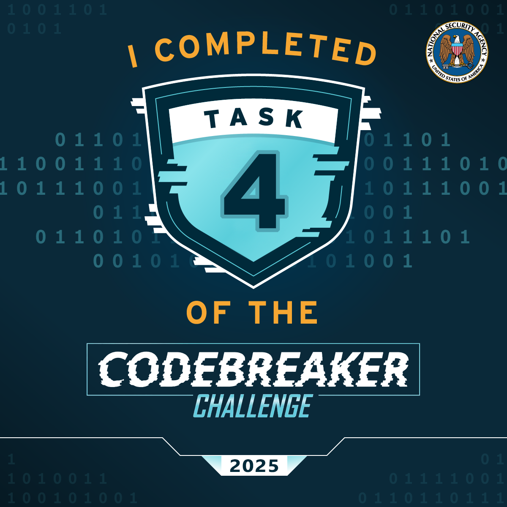

# Task 4 - Unpacking Insight - (Malware Analysis)

Once back at NSA the team contacts the NSA liaison at FBI to see if they have any information about what was discovered in the configuration data. FBI informs us that the facility registered to host that domain is on a watchlist for suspected criminal activity. With this tip, the FBI acquires a warrant and raids the location. Inside the facility, the server is discovered along with a suspect. The suspect is known to the FBI as a low-level malware actor. During questioning, they disclose that they are providing a service to host malware for various cybercrime groups, but recently they were contacted by a much more secretive and sophisticated customer. While they don't appear to know anything about who is paying for the service, they provide the FBI with the malware that was hosted.

Back at NSA, you are provided with a copy of the file. There is a lot of high level interest in uncovering who facilitated this attack. The file appears to be obfuscated.

You are tasked to work on de-obfuscating the file and report back to the team.


## Downloads

  - [obfuscated file (suspicious)](Downloads/suspicious)

## Prompt

    Submit the file path the malware uses to write a file

## Solution

The first thing to do with this file is to try learning more about what it is. In Linux, use `file suspicious` to see what we can find:
```
suspicious: ELF 64-bit LSB pie executable, x86-64, version 1 (SYSV), dynamically linked, interpreter /lib64/ld-linux-x86-64.so.2, BuildID[sha1]=3fc9729b05add2cba0bddd498f66c8b497060343, for GNU/Linux 3.2.0, stripped
```

We find that the file is an executable with the properties:
  - [ELF (Executable and Linkable Format)](https://en.wikipedia.org/wiki/Executable_and_Linkable_Format): Standard executable format for Linux systems
  - [64-bit](https://en.wikipedia.org/wiki/64-bit_computing): Made for a modern desktop processor
  - [LSB (Least Significant Bit)](https://en.wikipedia.org/wiki/Endianness): Little-endian byte ordering
  - [PIE (Position Independent Executable)](https://en.wikipedia.org/wiki/Position-independent_code): Loadable at any memory address to support [ASLR (Address Space Layout Randomization)](https://en.wikipedia.org/wiki/Address_space_layout_randomization) 
  - [x86-64 Architecture](https://en.wikipedia.org/wiki/X86-64): Still mostly standard for desktop computers
  - [Version 1 (SYSV)](https://en.wikipedia.org/wiki/UNIX_System_V): Uses System V ABI
  - [Dynamically Linked](https://en.wikipedia.org/wiki/Dynamic_linker): Uses shared libraries without being a self-contained binary
  - [Interpreter /lib64/ld-linux-x86-64.so.2](https://www.baeldung.com/linux/dynamic-linker): Linux dynamic linker
  - [GNU/Linux 3.2.0](https://en.wikipedia.org/wiki/Linux_kernel): Minimum Linux kernel version required to run
  - [Stripped](https://en.wikipedia.org/wiki/Strip_(Unix)): Debug symbols and symbol table removed to make reverse engineering more difficult

Now that we know much more about the program, let's try to run it in an [Ubuntu](https://ubuntu.com/) Docker container `./suspicious`: Seemingly nothing happens...

Let's try running it with [strace](https://strace.io/): `strace ./suspicious`:
```
execve("./suspicious", ["./suspicious"], 0x7ffd011beb80 /* 8 vars */) = 0
brk(NULL)                               = 0x59d13cef9000
mmap(NULL, 8192, PROT_READ|PROT_WRITE, MAP_PRIVATE|MAP_ANONYMOUS, -1, 0) = 0x73a0d6c19000
access("/etc/ld.so.preload", R_OK)      = -1 ENOENT (No such file or directory)
openat(AT_FDCWD, "/etc/ld.so.cache", O_RDONLY|O_CLOEXEC) = 3
fstat(3, {st_mode=S_IFREG|0644, st_size=13199, ...}) = 0
mmap(NULL, 13199, PROT_READ, MAP_PRIVATE, 3, 0) = 0x73a0d6c15000
close(3)                                = 0
openat(AT_FDCWD, "/lib/x86_64-linux-gnu/libm.so.6", O_RDONLY|O_CLOEXEC) = 3
read(3, "\177ELF\2\1\1\3\0\0\0\0\0\0\0\0\3\0>\0\1\0\0\0\0\0\0\0\0\0\0\0"..., 832) = 832
fstat(3, {st_mode=S_IFREG|0644, st_size=952616, ...}) = 0
mmap(NULL, 950296, PROT_READ, MAP_PRIVATE|MAP_DENYWRITE, 3, 0) = 0x73a0d6b2c000
mmap(0x73a0d6b3c000, 520192, PROT_READ|PROT_EXEC, MAP_PRIVATE|MAP_FIXED|MAP_DENYWRITE, 3, 0x10000) = 0x73a0d6b3c000
mmap(0x73a0d6bbb000, 360448, PROT_READ, MAP_PRIVATE|MAP_FIXED|MAP_DENYWRITE, 3, 0x8f000) = 0x73a0d6bbb000
mmap(0x73a0d6c13000, 8192, PROT_READ|PROT_WRITE, MAP_PRIVATE|MAP_FIXED|MAP_DENYWRITE, 3, 0xe7000) = 0x73a0d6c13000
close(3)                                = 0
openat(AT_FDCWD, "/lib/x86_64-linux-gnu/libc.so.6", O_RDONLY|O_CLOEXEC) = 3
read(3, "\177ELF\2\1\1\3\0\0\0\0\0\0\0\0\3\0>\0\1\0\0\0\220\243\2\0\0\0\0\0"..., 832) = 832
pread64(3, "\6\0\0\0\4\0\0\0@\0\0\0\0\0\0\0@\0\0\0\0\0\0\0@\0\0\0\0\0\0\0"..., 784, 64) = 784
fstat(3, {st_mode=S_IFREG|0755, st_size=2125328, ...}) = 0
pread64(3, "\6\0\0\0\4\0\0\0@\0\0\0\0\0\0\0@\0\0\0\0\0\0\0@\0\0\0\0\0\0\0"..., 784, 64) = 784
mmap(NULL, 2170256, PROT_READ, MAP_PRIVATE|MAP_DENYWRITE, 3, 0) = 0x73a0d691a000
mmap(0x73a0d6942000, 1605632, PROT_READ|PROT_EXEC, MAP_PRIVATE|MAP_FIXED|MAP_DENYWRITE, 3, 0x28000) = 0x73a0d6942000
mmap(0x73a0d6aca000, 323584, PROT_READ, MAP_PRIVATE|MAP_FIXED|MAP_DENYWRITE, 3, 0x1b0000) = 0x73a0d6aca000
mmap(0x73a0d6b19000, 24576, PROT_READ|PROT_WRITE, MAP_PRIVATE|MAP_FIXED|MAP_DENYWRITE, 3, 0x1fe000) = 0x73a0d6b19000
mmap(0x73a0d6b1f000, 52624, PROT_READ|PROT_WRITE, MAP_PRIVATE|MAP_FIXED|MAP_ANONYMOUS, -1, 0) = 0x73a0d6b1f000
close(3)                                = 0
mmap(NULL, 12288, PROT_READ|PROT_WRITE, MAP_PRIVATE|MAP_ANONYMOUS, -1, 0) = 0x73a0d6917000
arch_prctl(ARCH_SET_FS, 0x73a0d6917740) = 0
set_tid_address(0x73a0d6917a10)         = 23
set_robust_list(0x73a0d6917a20, 24)     = 0
rseq(0x73a0d6918060, 0x20, 0, 0x53053053) = 0
mprotect(0x73a0d6b19000, 16384, PROT_READ) = 0
mprotect(0x73a0d6c13000, 4096, PROT_READ) = 0
mprotect(0x59d126ea9000, 4096, PROT_READ) = 0
mprotect(0x73a0d6c51000, 8192, PROT_READ) = 0
prlimit64(0, RLIMIT_STACK, NULL, {rlim_cur=8192*1024, rlim_max=RLIM64_INFINITY}) = 0
munmap(0x73a0d6c15000, 13199)           = 0
rt_sigaction(SIGSEGV, {sa_handler=0x59d126e8a3f0, sa_mask=[], sa_flags=SA_RESTORER, sa_restorer=0x73a0d695f330}, {sa_handler=SIG_DFL, sa_mask=[], sa_flags=0}, 8) = 0
--- SIGSEGV {si_signo=SIGSEGV, si_code=SEGV_MAPERR, si_addr=NULL} ---
rt_sigaction(SIGSEGV, {sa_handler=SIG_DFL, sa_mask=[], sa_flags=SA_RESTORER, sa_restorer=0x73a0d695f330}, NULL, 8) = 0
getrandom("\xf7\x97\xd2\x81\x6c\xb1\x06\xf9", 8, GRND_NONBLOCK) = 8
brk(NULL)                               = 0x59d13cef9000
brk(0x59d13cf1a000)                     = 0x59d13cf1a000
clock_gettime(CLOCK_PROCESS_CPUTIME_ID, {tv_sec=0, tv_nsec=1833376}) = 0
openat(AT_FDCWD, "/proc/self/status", O_RDONLY) = 3
fstat(3, {st_mode=S_IFREG|0444, st_size=0, ...}) = 0
read(3, "Name:\tsuspicious\nUmask:\t0022\nSta"..., 1024) = 1024
close(3)                                = 0
munmap(0x6464697267206f74, 0)           = -1 EINVAL (Invalid argument)
exit_group(1)                           = ?
+++ exited with 1 +++
``` 

We know that something is hapenning and can see that the program is exiting with non-zero code 1 right after the output `openat(AT_FDCWD, "/proc/self/status", O_RDONLY) = 3`, seeming to suggest that the program is checking if it is being debugged, a common tactic by malware to avoid dynamic analysis.

Opening the file in Binja for static analysis, we immediately see the suspicious string `Username=root` in `main()` and the following humourous string that indicates the program was written by someone attempting to confuse:
```
Yo yo yo, no cap fr fr, walking into that Monday morning standup had me feeling like the Ohio final boss in some skibidi toilet code review gone wrong. The tech lead really pulled up and said \"we need to refactor this legacy codebase\" while I\'m sitting there mewing with maximum gyatt energy, trying not to griddy dance because this man thinks he\'s got that 10x engineer sigma grindset but he\'s serving major junior dev beta vibes, only in Ohio would someone push directly to main bruh. Meanwhile, Sarah from DevOps is straight up rizzing the life out of these CI/CD pipelines with her Docker configurations that hit different - homegirl got that skibidi bop bop deployment game, we absolutely stan a productive queen who\'s mewing her way through Kubernetes manifests like she\'s Duke Dennis teaching container orchestration. The whole team was lowkey fanum taxing each other\'s GitHub commits while griddy dancing around these sprint deadlines, but honestly? This tech stack is absolutely bussin bussin no cap, we\'re all feeling more blessed than Baby Gronk getting his first pull request merged by Livvy Dunne. When the product manager announced we\'re switching to TypeScript, the collective gyatt energy in that war room was giving unmatched Ohio vibes, like we just witnessed the skibidi toilet of programming languages compile in real time. Touch grass? Nah bestie, we\'re touching keyboards and living our most sigma developer life while the impostor among us pretends to understand Big O notation. This sprint planning was straight up giving main character energy but make it full-stack, periodt no printer detected, skibidi bop bop npm install yes yes.\n
```

Searching for the string `/proc/self/status` leads to the following function that is looking for if the PID for `TracerPid` contained within `/proc/self/status` is equal to 0 or not. Non-zero indicates that there is an attached debugger PID which causes the program to return with a non-zero exit code: 
```c++
00403470    uint64_t sub_403470()

00403493        void* fsbase
00403493        int64_t rax = *(fsbase + 0x28)
004034ad        FILE* stream = nullptr
004034b6        int16_t delim = 9
004034c5        char* lineptr = nullptr
004034ce        uint64_t n = 0
004034de        int32_t rbx_1
004034de        char* lineptr_1
004034de        
004034de        if (sub_4056a0(&stream, "r", "/proc/self/status") == 0)
004034fb            char* s
004034fb            char* i
004034fb            
004034fb            do
00403511                if (getline(&lineptr, &n, stream) == -1)
00403511                    goto label_403513
00403511                
004034e8                s = lineptr
004034f3                i = strstr(s, "TracerPid")
004034fb            while (i == 0)
004034fb            
0040356b            if (strtok(s, &delim) == 0)
0040356b                goto label_403513
0040356b            
00403572            char* rax_7 = strtok(s: nullptr, &delim)
00403572            
0040357a            if (rax_7 == 0)
0040357a                goto label_403513
0040357a            
00403581            lineptr_1 = lineptr
00403586            rbx_1.b = *rax_7 != 0x30
004034de        else
00403513        label_403513:
00403513            lineptr_1 = lineptr
00403518            rbx_1 = 1
00403518        
00403520        if (lineptr_1 != 0)
00403522            free(ptr: lineptr_1)
00403522        
00403527        FILE* fp = stream
00403527        
0040352f        if (fp != 0)
00403531            fclose(fp)
00403531        
0040353b        *(fsbase + 0x28)
0040353b        
00403544        if (rax == *(fsbase + 0x28))
00403552            return zx.q(rbx_1)
00403552        
0040358b        __stack_chk_fail()
0040358b        noreturn
```

We can patch line 0x403586 to NOP using Binja to ensure that the check for ascii zero is never made.
```
00403586            rbx_1.b = *rax_7 != '0'
```

We run again using `strace` and continue in this way, patching debugger checks until the exit code returned is 0. The included [suspicious_patched](suspicious_patched) ELF achieves this in an Ubuntu 24.04.3 LTS Docker container.

Now that the program is exiting with code 0, we notice this line toward the end of the trace:
```
newfstatat(AT_FDCWD, "/opt/dafin/intel/ops_brief_redteam.pdf", 0x7fffffffd6f0, 0) = -1 ENOENT (No such file or directory)
```

Unfortunately, `/opt/dafin/intel/ops_brief_redteam.pdf` is not the correct file path for this challenege. 

However, we notice that also in the `strace` output is now the line:
```
write(3, "\177ELF\2\1\1\0\0\0\0\0\0\0\0\0\3\0>\0\1\0\0\0\0\0\0\0\0\0\0\0"..., 52968) = 52968
```

There are many calls to `read()` in the trace, but this is the only call to `write()`. It turns out there is another binary packed into `suspicious`! We finally convinced the program to unpack this file and can capture this unpacked ELF file using `strace -e trace=write -s 53000 ./suspicious_patch.elf 2>&1 | grep -A1 "write(3" | tee unpacked.txt`. Open the output in [Notepad++](https://notepad-plus-plus.org/) to ensure that none of the output outside of the quotation marks is present and then use the following python script to convert the text data to a proper ELF (should be exactly 52,968 bytes when done):

```
#!/usr/bin/env python3

with open('unpacked.txt', 'r') as f:
    content = f.read()

# Decode the escaped string
binary_data = content.encode('utf-8').decode('unicode_escape').encode('latin1')

with open('unpacked', 'wb') as f:
    f.write(binary_data)

print(f"Wrote {len(binary_data)} bytes to unpacked")
```

Running `file unpacked` yields the following information, indicating that this binary is a shared object that communicates with the program that it was unpacked from!
```
ELF 64-bit LSB shared object, x86-64, version 1 (SYSV), dynamically linked, BuildID[sha1]=bea2ca1f4cec8f706c301aaa2960dfae0a72e65a, stripped
```

Running `./unpacked` directly results in a seg fault, but statically inspecting it in Binja reveals that the unpacked library has a function named `run()` that sets up an RC4 cipher at `0x00408d9c` using the passphrase `skibidi`.

The remainder of the `run()` function includes several check functions, all of which reference back to the RC4 state setup.

Running the first check hex data, `c71675c60fc7143616af4c1d340141baf922b9ac42a6c7070009f759c9e12e6377f3a071db1f`, through [CyberChef](https://gchq.github.io/CyberChef/) with [RC4](https://en.wikipedia.org/wiki/RC4) passphrase `skibidi`, input format `hex`, and output format `Latin1` yields the decrypted string `/opt/dafin/intel/ops_brief_redteam.pdf`.

The first conditional statement in `run()`, on line `0x00408db5`, runs a function check for file existence by looking at the encrypted data at `data_40d580` = `c71675c60fc7143616af4c1d340141baf922b9ac42a6c7070009f759c9e12e6377f3a071db1f`.

Each of the following conditionals in `run()` also pass data from `0x0040d580` - `0x0040d660` to the RC4 state. We naively attempt the same process on the next data entry, but it does not work. RC4 is a stream cipher where the decryption of each digit is dependent on the state of the cipher which is a function of all previous digits. So, we need to pass in the data all at once. The following are each of the data entries in order of use:

1. c71675c60fc7143616af4c1d340141baf922b9ac42a6c7070009f759c9e12e6377f3a071db1f
2. d238bd57189ec1375ac9b7bf93dad34ba4
3. d562fb654a1a4603bcf4ae739e
4. b4b2e48e6d
5. 78c850a517827afdbb88
6. f32927c9623a5945155fbdd97584797a5fac1ea330150cfa870cc63a26d98b
7. 394d542635 ("9MT&5")
8. 4d542635 ("MT&5") (SKIP THIS ONE)
9. 53d9c6d8098227cfa1de178a
10. d2208a737562cb5bb565da5f74b1b54a197d5792
11. 10dbf50699
12. c4
13. 4c3d5b9bf53679e73b655c041210a5bd
14. 5cf8803dc884fc825aaa1b139cb2

Passing these in progresses well until the eighth entry, after which the plaintext becomes nonsense. It turns out that data entry 8 is not used and if we skip it, we can recover the entire plaintext stream. The correct cipher hex input is:
```
c71675c60fc7143616af4c1d340141baf922b9ac42a6c7070009f759c9e12e6377f3a071db1fd238bd57189ec1375ac9b7bf93dad34ba4d562fb654a1a4603bcf4ae739eb4b2e48e6d78c850a517827afdbb88f32927c9623a5945155fbdd97584797a5fac1ea330150cfa870cc63a26d98b394d54263553d9c6d8098227cfa1de178ad2208a737562cb5bb565da5f74b1b54a197d579210dbf50699c44c3d5b9bf53679e73b655c041210a5bd5cf8803dc884fc825aaa1b139cb2
```

These are the resulting output strings:

1. /opt/dafin/intel/ops_brief_redteam.pdf
2. DAFIN_SEC_PROFILE
3. /proc/cpuinfo
4. flags
5. hypervisor
6. systemd-detect-virt 2>/dev/null
7. rnone
8. 203.0.113.42
9. GET /module HTTP/1.1
10. /tmp/.lKdSyPDboQRURivd
11. execute_module

We see that the malware is connecting to the malicious server at IP address `203.0.113.42`, downloading and storing a module, and then executing the module.

The answer to the task's question of the path that the malware uses to write a file is `/tmp/.lKdSyPDboQRURivd`!

### Notes

There are several checks the unpacked binary makes before fully executing the malicious connection, including:
  - Does the file `/opt/dafin/intel/ops_brief_redteam.pdf` exist?
  - Is the DAFIN_SEC_PROFILE environment variable set? 
  - Is the current year 2024?
  - Is the program running as root?
  - Is the program running with a hypervisor?
  - Is the program running virtualized

This indicates that the malware is very narrowly and specifically targeting a machine or network, perhaps to exfil the file `/opt/dafin/intel/ops_brief_redteam.pdf` for malicious purposes or targeting the red team for retribution or other purpses.

## Result

<div align="center" 
     style="background-color: #dff0d8;
            border-color: #d6e9c6;
            color: #3c763d;
            padding: 15px;
            border-radius: 4px;
            font-family: Roboto, Helvetica, Arial, sans-serif;
            font-size: 14px;
            line-height: 1.42857143;">
Task Completed at Sat, 27 Dec 2025 17:12:09 GMT: 

---

Superb work unpacking and analyzing that Malware!

</div>

---

<div align="center">



</div>