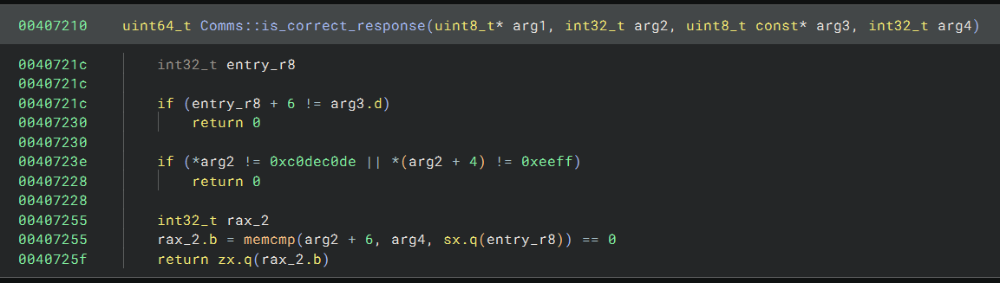
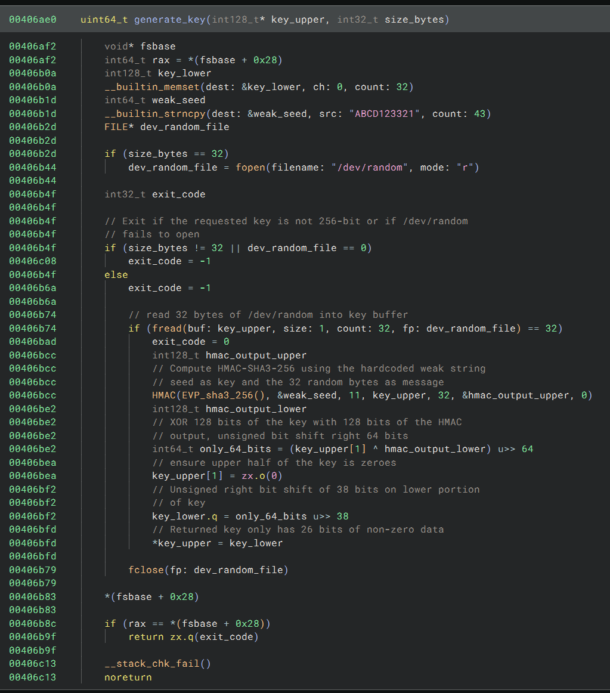
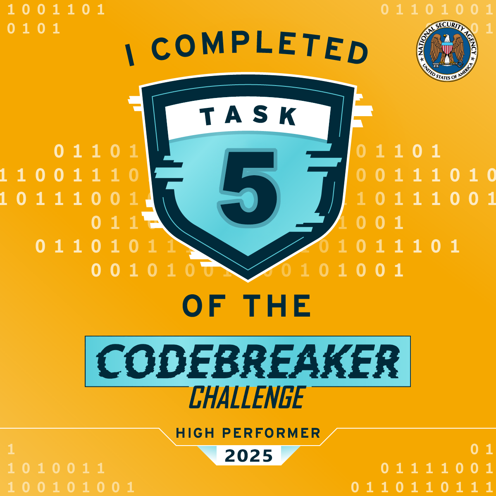

# Task 5 - Putting it all together - (Cryptanalysis)

NSA analysts confirm that there is solid evidence that this binary was at least part of what had been installed on the military development network. Unfortunately, we do not yet have enough information to update NSA senior leadership on this threat. We need to move forward with this investigation!

The team is stumped - they need to identify something about who was controlling this malware. They look to you. "Do you have any ideas?"

## Prompt

    Submit the full URL to the adversary's server

## Solution

The first detail to be noticed on this task is that there are no downloads to analyze. Luckily, staring at task 2 finally paid off and I had a strong hunch that `0xdec0dec0ffee` was the key to progress. What better place for a server URL to be discovered than a PCAP?

Continuing to look through the `unpacked` binary from task 4, it is clear that there is much more functionality baked in than was previously explored. Binja shows a `Comms()` object with methods that include `recv_rsa_pubkey()`, `rsa_encrypt()`, `send_aes_keys()` and `send_message()`.

Using Binja's `Find` function for `dec0dec0ffee` shows a single result in the `.rodata` section of the binary at address `0x0040a141`. This data is referenced at address `004072bd` in the `Comms::send_message()` method in what looks like is a `vector_insert()` function. This function is called twice in the method: once to insert `0xdec0dec0ffee` into the vector and a second time to insert the message to send.

`0xdecodecoffee` is also found in `Comms::is_correct_response()`, in reversed byte order, at address `0x0040723e`:



By following a `Comms` object from construction through its lifespan, we can gain some insight into where the cryptography is and how to perform cryptanalysis:
  - `0x0040715d`: Create 4 [OpenSSL](https://www.openssl.org/) cipher contexts using `EVP_CIPHER_CTX_new()` [https://manpages.ubuntu.com/manpages/focal/man3/EVP_CIPHER_CTX_new.3ssl.html]
  - `0x00407187`: Call `Comms::gen_key(this, this[20])` and `Comms::gen_key(this, this[36])` to create two 16-bit keys
  - `0x00407059`: `Comms::gen_key()` calls custom `generate_key()` function
  - `0x00406b1d`: Create an [HMAC](https://en.wikipedia.org/wiki/HMAC) seed using the string `ABCD123321` [https://docs.openssl.org/3.0/man3/HMAC/]
  - `0x00406b44`: Open [`/dev/random`](https://en.wikipedia.org/wiki//dev/random)
  - `0x00406b74`: Read 256 bits of randomness into the key
  - `0x00406bcc`: Create [HMAC-SHA3-256](https://manpages.debian.org/experimental/libssl-doc/EVP_sha3_256.3ssl.en.html#EVP_sha3_224()) hash using the string as key and random number as message
  - `0x00406be2`: XOR 128 bits of the key with 128 bits of the hash output, [unsigned right shift](https://developer.mozilla.org/en-US/docs/Web/JavaScript/Reference/Operators/Unsigned_right_shift) the result by 64 bits, and store in a 64-bit integer
  - `0x00406bea`: Ensure the top 128 bits of the key are zero
  - `0x00406bf2`: Unsigned right shift the 64-bit XOR result by another 38 bits
  - `0x00406bfd`: Return a 26 bit non-zero value as the key value
  - `0x004071a7`: Initialize double [AES](https://en.wikipedia.org/wiki/Advanced_Encryption_Standard) encryption and decryption with two 26-bit keys
  - `0x00406753`: AES encryption uses `EVP_aes_128_ecb()`, AES 128-bit [electronic codebook](https://www.geeksforgeeks.org/computer-networks/electronic-code-book-ecb-in-cryptography/) block encryption
  - `0x004067a3`: AES decryption uses `EVP_aes_128_ecb()` (same as encryption)
  - `0x00407351`: `Comms::send_message()` calls `custom_enc()`
  - `0x004069e9`: `custom_enc()` calls `aes_encrypt()` twice in a row, once with each key
  - `0x0040680f`: `aes_encrypt()` initializes the cipher context using `EVP_EncryptInit_ex()` with no [initialization vector (IV)](https://en.wikipedia.org/wiki/Initialization_vector)



In summary, double AES 128-bit encryption is in use, but with the security flaws of only a 26-bit key and no IV. 

We also know that OpenSSL uses [PKCS#7 padding](https://en.wikipedia.org/wiki/Padding_(cryptography)#PKCS#5_and_PKCS#7) from [https://docs.openssl.org/3.3/man1/openssl-enc/#notes]. This padding standard adds a number of bytes to the last block to ensure that the last block length is 16 bytes. If the last block length is x bytes less than 16 bytes, x bytes of the numeric value of x are appended to the block. For example, a last block of length 10 bytes will have 6 bytes of value `0x06` appended to it. For last blocks that are already 16 bytes long, another block of 16 bytes of padding is added, all of the the value `0x10 = 16`.

We should be able to break this encryption, but we need some (plaintext, ciphertext) pairs to do so.

Looking at the PCAP IPv4 stream 34 from task 2 and the contents of the unpacked binary, we can piece together the message flow as follows:
1. Server -> Client: send RSA public key
2. Client -> Server: send AES keys encrypted using RSA public key
3. Server -> Client: KEY_RECEIVED
4. Client -> Server: AES encrypted message 1 (REQCONN)
5. Server -> Client: AES encrypted message 2 (REQCONN_OK)
6. Client -> Server: AES encrypted message 3
7. Server -> Client: AES encrypted message 4


Taking a close look at the raw contents of each PCAP message sheds some more light on possible plaintext ciphertext pairs. Note that each plaintext and ciphertext message starts with `0xdec0dec0ffee`:

1. Server -> Client: send public RSA key (plaintext)
```
-----BEGIN PUBLIC KEY-----
MIIBIjANBgkqhkiG9w0BAQEFAAOCAQ8AMIIBCgKCAQEAx3Gp23tmyukfcyJqkImm
MfA98r4MBy/Qso1Zz7wB82ooE/rIMiWSQjMCH1ph4cCwGii5UKckNhYxUH38sfs1
nnyAGXY9cCtloPPbTvlUI1wrvESigPWH6q5tcQGlHretil4tU94Fy3xVD9p+dhm1
CDM8HcpVRVfqDHEd/pBpY49TGZohVkun9RW8VFO9XeSnPccPExIfZhnf1tSI3cMh
CeuMXl8ZrBoyqT3VpVntJ0KdyZV/K4G/mbDnkRHIwLrDeQGd8Mm/7XDqIXvvnMPa
PclZd95mT4Yo+6LOBu6VB74RSh5eTPsygYDexwxHjBtsJYOZciUnlyRauj67NfLW
SwIDAQAB
-----END PUBLIC KEY-----
```
```
dec0dec0ffee2d2d2d2d2d424547494e205055424c4943204b45592d2d2d2d2d0a4d494942496a414e42676b71686b6947397730424151454641414f43415138414d49494243674b4341514541783347703233746d79756b6663794a716b496d6d0a4d6641393872344d42792f51736f315a7a37774238326f6f452f72494d695753516a4d43483170683463437747696935554b636b4e68597855483338736673310a6e6e7941475859396343746c6f50506254766c55493177727645536967505748367135746351476c48726574696c347455393446793378564439702b64686d310a43444d384863705652566671444845642f70427059343954475a6f68566b756e3952573856464f395865536e50636350457849665a686e663174534933634d680a4365754d586c385a72426f797154335670566e744a304b64795a562f4b34472f6d62446e6b524849774c724465514764384d6d2f37584471495876766e4d50610a50636c5a6439356d5434596f2b364c4f4275365642373452536835655450737967594465787778486a4274734a594f5a6369556e6c795261756a36374e664c570a53774944415141420a2d2d2d2d2d454e44205055424c4943204b45592d2d2d2d2d0a
```

---

2. Client -> Server: send AES keys encrypted using RSA public key (RSA encrypted)
```
dec0dec0ffee34c68c6dceeba98a1efb6a62aa61046e9bf52f21d12d0aed2cf639b7d2ac49aeb404c50634377008e21b5fe747b05fd3d47f7bbdc4eb3cd5589befbf6c3f460367b5b50ab9996af382bceebef5236dbf9e184e3cccfc9d209556a00d011e3471c442093abee35280196c339d2ecb5643a3e13b83f7eb80c6f9c0eb73d9b96a1b3a6e6b44262c890c641a8096dc31621c139457ee3261574146dccf30b7fd2eeafb3530fd45dc576e89c3b04abde40930941a1d22b4c0204345fb52696b4a9868963689fcbfe455d26349752d2200f9a98946bec42a6b6f4692d4ceb149132aaadced77f09f39bf0effdaf3e963d85508092c9b2f6f851bfd791400cd7b87708b
```
---

3. Server -> Client: KEY_RECEIVED
  - `0xdec0dec0ffee + "KEY_RECEIVED"`
  - 18 bytes
  - plaintext
```
dec0dec0ffee4b45595f5245434549564544
```
---

4. Client -> Server: AES encrypted message 1
  - `0xdec0dec0ffee + "REQCONN" + padding(0x03) + padding(0x10)`
  - `dec0dec0ffee524551434f4e4e030303 + 10101010101010101010101010101010`
  - 32 bytes
  - ciphertext

This is the first AES encrypted message sent. We know the plaintext from the binary static analysis of `Comms::application_handshake()` that happens in `Comms::full_handshake()` The full handshake is:
  - `Comms::recv_rsa_pubkey()`
  - `Comms::send_aes_keys()`
  - `Comms::send_message()`

We know the padding from the PKCS#7 standard and we know that 16 bytes of `0x10` padding were added during the second encryption round.

```
d864ca7dffe42aba9374c36153f271a516f3bc52e4473dc41c730f6dc9830a6a
```
---

5. Server -> Client: AES encrypted message 2  
  - `0xdec0dec0ffee + "REQCONN_OK" + padding[0x10] + padding[0x10]`
  - `dec0dec0ffee524551434f4e4e5f4f4b + 10101010101010101010101010101010 + 10101010101010101010101010101010`
  - 48 bytes

This is the second plaintext we could deduce, although this one was more difficult due to difficulties in interpreting the binary. Note that this message and all following also have 16 bytes of identically encrypted padding appended.
```
7f8a2365653479b756476d21f4bebb5fbd2ad9e26c1747047a0abfe0e567aa3616f3bc52e4473dc41c730f6dc9830a6a
```
---

6. Client -> Server: AES encrypted message 3
  - `0xdec0dec0ffee + ? + padding[0x10]`
  - 64 bytes
```
40c4740b601f4b34387f7ed933a9db8c0bbce684b23017f9227be9dcf26cdcdfdb9e4c6f725b2d1f9ccc9eede8186e5216f3bc52e4473dc41c730f6dc9830a6a
```
---

7. Server -> Client: AES encrypted message 4 (80 bytes) (0xdec0dec0ffee + ? + padding[0x10])
  - `0xdec0dec0ffee + ? + padding[0x10]`
  - 80 bytes
```
95088b71ffebf51a65753dbae1986c33f0f412848c2d5b6befaf83668796dc21374199ad526811d0c902ff252f3cbe2960bcc96de8e68dc4146a39a2922eea1516f3bc52e4473dc41c730f6dc9830a6a
```
---

To repeat, we have the following double encryption (plaintext, ciphertext) pairs to work with:

  - `(dec0dec0ffee524551434f4e4e030303, d864ca7dffe42aba9374c36153f271a5)`
  - `(dec0dec0ffee524551434f4e4e5f4f4b, 7f8a2365653479b756476d21f4bebb5f)`
  - `(10101010101010101010101010101010, bd2ad9e26c1747047a0abfe0e567aa36)`

We also know that the 16 byte padding added to each of the AES encrypted messages was only encrypted using key 2:
  - `(10101010101010101010101010101010, 16f3bc52e4473dc41c730f6dc9830a6a) (K2 encryption only)`


We can proceed with cracking the encryption keys in two ways:
1. [Brute force](https://en.wikipedia.org/wiki/Brute-force_attack) key 2 using the singly encrypted padding block pair. Then, use key 2 to get an intermediate singly decrypted value for one of the known (plaintext, ciphertext) pairs and brute force to find key 1.
2. Use a [meet-in-the-middle attack](https://en.wikipedia.org/wiki/Meet-in-the-middle_attack) one of the (p,c) pairs. This attack stores each possible value of key 1 with its singly encrypted intermediate ciphertext value in a hash table during phase one for lookup in phase two. During phase 2, the final ciphertext is singly decrypted for each possible value of key 2 and then checked against the hash table. If there is a match, then both key 1 and key 2 have been found.


Included is a [Claude AI](https://claude.ai) implemented [Rust](https://rust-lang.org/) solver that can solve the problem using either method in a short amount of time on a desktop PC. (Both [Windows PE](decrypt_rust.exe) and [Linux ELF](decrypt_rust) executables included, along with source code)
  - `./decrypt padding --padding-k2 16f3bc52e4473dc41c730f6dc9830a6a --padding-k1k2 bd2ad9e26c1747047a0abfe0e567aa36` Runs in ~3.5s
  - `./decrypt mitm --plaintext dec0dec0ffee524551434f4e4e030303 --ciphertext d864ca7dffe42aba9374c36153f271a5` Runs in ~22s


After running, we find that the keys are as follows in hexadecimal (little-endian!)

Key 1 = `6b99b502000000000000000000000000` <br>
Key 2 = `e459a002000000000000000000000000`

We can use CyberChef to chain two AES Decrypt blocks together, with no IV, and hex inputs and outputs on all but the last output. The following messages are decrypted:

6. encrypted message 3: `DATA REQUEST mattermost_url`
7. encrypted message 4: `https://198.51.100.166/mattermost/Qf-77_P7XxKNO`

The full URL to the adversary's server is `https://198.51.100.166/mattermost/Qf-77_P7XxKNO`!!

### Notes

  - The code could be implemented for parallel CPU operation to speed processing.
  - More interesting would be a CUDA GPU parallel solver implementation, but this would take some effort to achieve.

## Result

<div align="center">




</div>