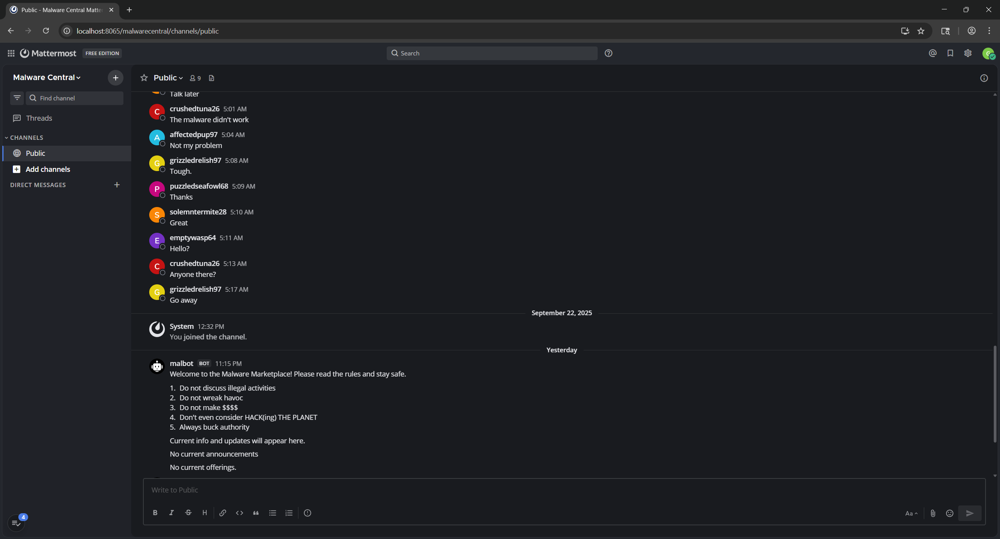

# Task 6 - Crossing the Channel - (Vulnerability Research)

This high visibility investigation has garnered a lot of agency attention. Due to your success, your team has designated you as the lead for the tasks ahead. Partnering with CNO and CYBERCOM mission elements, you work with operations to collect the persistent data associated with the identified Mattermost instance. Our analysts inform us that it was obtained through a one-time opportunity and we must move quickly as this may hold the key to tracking down our adversary! We have managed to create an account but it only granted us access to one channel. The adversary doesn't appear to be in that channel.

We will have to figure out how to get into the same channel as the adversary. If we can gain access to their communications, we may uncover further opportunity.

You are tasked with gaining access to the same channel as the target. The only interface that you have is the chat interface in Mattermost!


## Downloads

  - [Mattermost instance (volumes.tar.gz)](Downloads/volumes.tar.gz)
  - [User login (user.txt)](Downloads/user.txt)

## Prompt

    Submit a series of commands, one per line, given to the Mattermost server which will allow you to gain access to a channel with the adversary.

## Solution

For this task we are given an entire (!) Mattermost database, python Mattermost bot code, and a username + password to login with. Since Mattermost is a messaging board with a GUI, we work with Claude AI, iteratively, to create a local Docker instance of Mattermost that can run each of the individual components in separate, connected containers:
  - [PostgreSQL](https://www.postgresql.org/) database
  - [Mattermost](https://github.com/mattermost/mattermost) server
  - Mattermost [mmpy_bot](https://github.com/attzonko/mmpy_bot) Python bot

The default PostgreSQL port (5432) is used and the bot settings are defined in `bot.py`:
```
bot = Bot(
    settings=Settings(
        MATTERMOST_URL = os.environ.get("MATTERMOST_URL", "http://127.0.0.1"),
        MATTERMOST_PORT = int(os.environ.get("MATTERMOST_PORT", 8065)),
        BOT_TOKEN = os.environ.get("BOT_TOKEN"),
        BOT_TEAM = os.environ.get("BOT_TEAM", "test_team"),
        SSL_VERIFY = os.environ.get("SSL_VERIFY", "False") == "True",
        RESPOND_CHANNEL_HELP=True,
    ),
    plugins=[SalesPlugin(), HelpPlugin(), OnboardingPlugin(),ManageChannelPlugin(),AdminPlugin()],
)
bot.run()
```

First, the server and database are successfully stood up by running `docker compose up`. [DBeaver](https://dbeaver.io/) is utilized to connect to the database using the user and password in [docker-compose.yml](docker-compose.yml) (either Claude guessed correctly or []`pg_hba.conf`](https://www.postgresql.org/docs/9.1/auth-pg-hba-conf.html) is set permissively). After poking around a bit, we find the `useraccesstokens` table (under `Databases -> mattermost -> Schemas -> public -> Tables`) that includes the bot token for Malbot!

We get to work on getting Malbot up and running and create a [Dockerfile](Dockerfile) for creating a custom Docker image with Python and the correct packages and permissions. From `bot.py`, a `-v` flag is added to run with debug level verbosity.

With these files created and Docker containers orchestrated, we can connect (with [Chrome](https://www.google.com/chrome/) to be safe) to the Mattermost instance at `localhost:8065`. Select `View in Browser` and use the given username and password to login:
  - username: `gleefulfalcon86`
  - password: `XUNGbENqzQJGDUBm`

Close the browser and reopen, or try manually, after login if redirection to `localhost:8065/malwarecentral/channels/public` is not automatic. Upon accessing this channel for the first time, immediately go to `Settings > Display > Theme` to change to dark mode.



At this point, we would like to figure out which channel we need to join, who the adversary is, and what the vulnerabilities are in Malbot's code that will allow us to accomplish this.


Review the database for `posts`, `users`, `channels`, and `channelmembers`.

Test that !nego allows creating a private channel with 2 users and a mod that are in the channel !nego is called from

See that the Admin is in only 1 private channel, the one discussing malicious access to US military

Review malbot code to realize monkeypaw patch doesn't cover group msg

Also, the code has a vulnerability that allows entering an existing private channel

Note that the target private channel conveniently has all but 4 members already: yourself, 1 mod, and 2 others

Create a group msg with those not in the target private channel

Use !nego from the group msg to join the target channel

Format the command into two lines to satisfy the grader


## Result

<div align="center" 
     style="background-color: #dff0d8;
            border-color: #d6e9c6;
            color: #3c763d;
            padding: 15px;
            border-radius: 4px;
            font-family: Roboto, Helvetica, Arial, sans-serif;
            font-size: 14px;
            line-height: 1.42857143;">
Task Completed at Thu, 01 Jan 2026 23:55:24 GMT: 

---

Awesome job! We can now access the channel and are one step closer to removing this threat.

</div>

---

<div align="center">


</div>