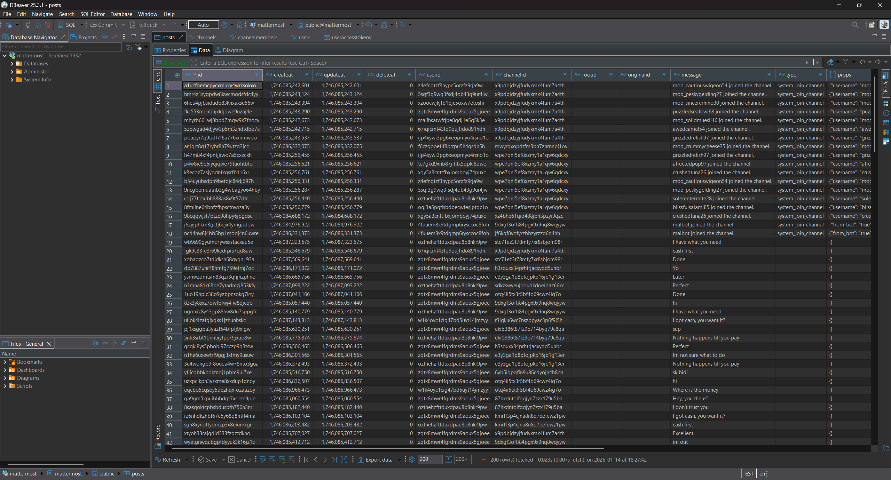

# Task 6 - Crossing the Channel - (Vulnerability Research)

This high visibility investigation has garnered a lot of agency attention. Due to your success, your team has designated you as the lead for the tasks ahead. Partnering with CNO and CYBERCOM mission elements, you work with operations to collect the persistent data associated with the identified Mattermost instance. Our analysts inform us that it was obtained through a one-time opportunity and we must move quickly as this may hold the key to tracking down our adversary! We have managed to create an account but it only granted us access to one channel. The adversary doesn't appear to be in that channel.

We will have to figure out how to get into the same channel as the adversary. If we can gain access to their communications, we may uncover further opportunity.

You are tasked with gaining access to the same channel as the target. The only interface that you have is the chat interface in Mattermost!


## Downloads

  - [Mattermost instance (volumes.tar.gz)](Downloads/volumes.tar.gz)
  - [User login (user.txt)](Downloads/user.txt)

## Prompt

    Submit a series of commands, one per line, given to the Mattermost server which will allow you to gain access to a channel with the adversary.

## Solution

For this task we are given an entire (!) Mattermost database, python Mattermost bot code, and a username + password to login with. Since Mattermost is a messaging board with a GUI, we work with Claude AI, iteratively, to create a local Docker instance of Mattermost that can run each of the individual components in separate, connected containers:
  - [PostgreSQL](https://www.postgresql.org/) database
  - [Mattermost](https://github.com/mattermost/mattermost) server
  - Mattermost [mmpy_bot](https://github.com/attzonko/mmpy_bot) Python bot

The default PostgreSQL port (5432) is used and the bot settings are defined in `bot.py`:
```python
bot = Bot(
    settings=Settings(
        MATTERMOST_URL = os.environ.get("MATTERMOST_URL", "http://127.0.0.1"),
        MATTERMOST_PORT = int(os.environ.get("MATTERMOST_PORT", 8065)),
        BOT_TOKEN = os.environ.get("BOT_TOKEN"),
        BOT_TEAM = os.environ.get("BOT_TEAM", "test_team"),
        SSL_VERIFY = os.environ.get("SSL_VERIFY", "False") == "True",
        RESPOND_CHANNEL_HELP=True,
    ),
    plugins=[SalesPlugin(), HelpPlugin(), OnboardingPlugin(),ManageChannelPlugin(),AdminPlugin()],
)
bot.run()
```

First, the server and database are successfully stood up by running `docker compose up` (make sure that `volumes/` is extracted in the same directory). [DBeaver](https://dbeaver.io/) is utilized to connect to the database using the user and password in [docker-compose.yml](docker-compose.yml) (either Claude guessed correctly or [`pg_hba.conf`](https://www.postgresql.org/docs/9.1/auth-pg-hba-conf.html) is set permissively). After poking around a bit, we find the `useraccesstokens` table (under `Databases -> mattermost -> Schemas -> public -> Tables`) that includes the bot token for `Malbot`!

We get to work on getting Malbot up and running and create a [Dockerfile](Dockerfile) for creating a custom Docker image with Python and the correct packages and permissions. From `bot.py`, a `-v` flag is added to run with debug level verbosity.

With these files created and Docker containers orchestrated, we can connect (with [Chrome](https://www.google.com/chrome/) to be safe) to the Mattermost instance at `localhost:8065`. Select `View in Browser` and use the given username and password to login:
  - username: `gleefulfalcon86`
  - password: `XUNGbENqzQJGDUBm`

Close the browser and reopen, or try manually, after login if redirection to `localhost:8065/malwarecentral/channels/public` is not automatic. Upon accessing this channel for the first time, immediately go to `Settings > Display > Theme` to change to dark mode.


At this point, we would like to figure out which channel we need to join, who the adversary is, and what the vulnerabilities are in Malbot's code that will allow us to accomplish this. Opening the database in DBeaver, there is obviously more information than is pertinent to the task at hand, as seen below. I prefer using spreadsheets to slice my data, so copy and paste the tables into [Microsoft Excel](https://www.microsoft.com/en-us/microsoft-365/excel).



We look at the `posts` table and sort by date and channel_id. The channel_id `me8re6q7fiyh3jgm6ob38nen4h` has an interesting conversation between user_id `zqtx8mwr4fgrdms9aoux5gjoee`, `ozthehzfttduxdpau8p8nkr9pw`, and `cqpsdauwxffodca9ia4bb76ojy`:
```
I think we can get in
Where?
Something called the 'Cyber Operations Squadron'
Is that the US Military
Yeah.
You are crazy!
Dude...
Better ask the boss
Excellent idea! We would all be rich with the amount of money we could sell this access for!
yeah!
Im gunna buy a lambo
I will get in touch with a sucker to host files for us just in case. Make sure to use our mobile app to ensure you don't miss any communication. You don't want to make mistakes.
OK
Got it
Yes
```

Looking up the channel_id, we find that the channel is private with name `channel70148`.

Looking up the user_ids in `users`, we find that this conversation is between the following three users and that the "boss" is apparently `admin_pacifiedgarlic59`:
```
solemntermite28
puzzledseafowl68
admin_pacifiedgarlic59
```

Taking a look at the `channelmembers` table, we see that `admin_pacifiedgarlic59` is only a member of 2 channels: the one above and a direct message with `Malbot`. It is fairly obvious that our target is `admin_pacifiedgarlic59` and the channel to enter with them is `channel70148`.

---

Turning our attention `Malbot`, we can send the command `@malbot help` or `!help` in the Public channel to get the following direct message response:
```
The following functions have been registered:

(*) require the use of @botname, (+) can only be used in direct message

- !add_offering name type os oday_or_nday creator price
    Add a new malware offering.
- !delete nonpinned
    get rid of any posts that aren't pinned
- !get_offerings
    List all malware offerings.
- ^!help$ - Shows this help information.
- !nego channel seller moderator1 moderator2
    Create a negotiation channel to close a deal!
- !record_sale buyer price offering_id
    Record a sale of malware.
- ^!update_announcement (.+)$
- ^!util df
- ^!util free$
- ^!util uptime$
- help (*) - Shows this help information.
```

We can explore the source code in `volumes/bot/` to find each of these functions and see in `bot.py` that a [monkey patch](https://en.wikipedia.org/wiki/Monkey_patch) has been applied. The patches appear to attempt to modify functions to be called only by specified users and not in direct messages, depending on the function parameters. We will keep this in mind when parsing the commands for `Malbot`.
```
import mmpy_bot_monkeypatch  # Ensure monkeypatch is applied before any plugin imports
```

`plugin_admin.py` contains the following functions, all restricted to users with usernames starting with `mod_` or `admin_`. None of them are interesting:
  - `^!util df`: calls `df -h -x tmpfs` to display disk usage info
  - `^!util free$`: calls `uptime` to display uptime information
  - `^!util uptime$`: calls `free -h` to display memory usage statistics

`plugin_managechannel.py` only has the `!delete nonpinned` function, which can be called by anyone to delete all non-pinned messages in any channel but direct.

`plugin_onboarding.py` sends `Malbot` announcements every hour to the channel `public`. This should be seen when starting Mattermost for the first time. The only function in this plugin is `^!update_announcement (.+)$` and is restricted to usernames starting with `mod_` (Note that we can simply change our username to append `mod_` or `admin_` to achieve this functionality, but presumably only in our local test environment and when attacking the live target Mattermost instance.)

The last plugin class file, `plugin_sales.py`, contains the vulnerable function. It also contains several functions to interact with the malware for sale database, which we did not get nor does it turn out to matter for the task. It is interesting to note that this Mattermost team is a marketplace for malware which is no uncommon in the world today.
  - `^!add_offering (.*)$`: Adds malware for sale to the database
  - `^!get_offerings (.*)$`: Lists malwares for sale
  - `^!record_sale (.*)$`: Records malware sale

The interesting function is `^!nego (.*)$` which, according to the help message, is supposed to be called with the syntax `!nego channel seller moderator1 moderator2`. Let us look closely at what the code is actually implemented to do:
  - The function must be called outside of a direct message (vulnerability) exactly 4 additional arguments:
  ```python
    @listen_to('^!nego (.*)$', no_direct=True,human_description="!nego channel seller moderator1 moderator2\n\tCreate a negotiation channel to close a deal!")
    def handle_nego(self : Plugin, message: Message, *args):
        logger.debug(f"handle_nego called with message: {message.text}")
        args = message.text.strip().split()
        if len(args) != 5:
            self.driver.reply_to(message, "Usage: !nego channel seller moderator1 moderator2")
            logger.warning("handle_nego: Incorrect number of arguments")
            return
  ```
  - Only the last argument needs to be a moderator (vulnerability):
  ```python
        user1 = message.sender_name
        _, channel_name, user2, user3, user4 = args[:6]
        if not user4.startswith('mod_'):
            self.driver.reply_to(message, f"You must have a mod")
            return
  ```
  - Using a new channel name for `channel` will create a new private channel:
  ```python
        # Create channel
        channel_options = {
            "team_id": team_id,
            "name": channel_name,
            "display_name": display_name,
            "type": "P"
        }
        logger.debug(f"Creating channel with options: {channel_options}")
        try:
            channel = self.driver.channels.create_channel(channel_options)
            print(f"[DEBUG] Channel API response: {channel}")
  ```
  - Using an existing channel name will catch an exception, but fails to return thus allowing code to continue (vulnerability):
  ```python
        #hide weird exception when we have an archived channel with the same name, we'll just unarchive it
        except Exception as e:
            print(f"[DEBUG] Exception while creating channel: {e}")
            # Try to unarchive the channel if it exists
            try:
                archived_channel = self.driver.channels.get_channel_by_name(channel_name, team_id)
                if archived_channel and archived_channel.get('delete_at') > 0:
                    logger.info(f"Unarchiving existing channel: {archived_channel}")
                    self.driver.channels.unarchive_channel(archived_channel.get('id'))
                    channel = archived_channel
            except Exception as e:
                self.driver.reply_to(message, f"Failed to create or unarchive channel: {e}")
        #we either created a new channel or unarchived an existing one
        print(f"[DEBUG] getting channel: {channel_name} in team {team_id}")
        channel = self.driver.channels.get_channel_by_name(team_id, channel_name)
        channel_id = channel.get('id') if isinstance(channel, dict) else channel.json().get('id')
        print(f"[DEBUG] channel_id: {channel_id}")
  ```
  - All users in the call must exist in the team and be unique:
  ```python
        # Get user ids
        user_ids = []
        for uname in [user1, user2, user3, user4]:
            logger.debug(f"Looking up user: {uname}")
            user = self.driver.users.get_user_by_username(uname)
            logger.debug(f"User API response: {user}")
            uid = user.get('id') if isinstance(user, dict) else user.json().get('id')
            logger.debug(f"user_id for {uname}: {uid}")
            if not uid:
                self.driver.reply_to(message, f"User not found: {uname}")
                logger.warning(f"handle_nego: User not found: {uname}")
                return
            user_ids.append(uid)
        if len(set(user_ids)) != 4:
            logger.warning(f"incorrect number of users to run command")
            self.driver.reply_to(message, f"incorrect number of users to run command")
            return
        print(f"[DEBUG] All user_ids: {user_ids}")
  ```
  - All users in the call must not yet be in the target channel and must be in the calling channel:
  ```python
        # Check if channel already has members
        existing_members = self.driver.channels.get_channel_members(channel_id)
        existing_member_user_ids = [member.get('user_id') for member in existing_members]
        existing_user_ids = any(uid in user_ids for uid in existing_member_user_ids)
        if existing_user_ids:
            # If the channel already has members, we should not add them again
            # This is a safeguard against creating duplicate entries in an archived channel
            print(f"[DEBUG] Existing members in channel {channel_id}: {existing_member_user_ids}, this shouldn't happen! archived channels should be empty")
            return
        # make sure not adding randos
        current_members_ids = [m['user_id'] for m in self.driver.channels.get_channel_members(message.channel_id)]
        if not (user_ids[0] in current_members_ids and user_ids[1] in current_members_ids and
                user_ids[2] in current_members_ids and user_ids[3] in current_members_ids):
            self.driver.reply_to(message, f"Could not find users")
            return
  ```
In summary, to get from the channel `public` to the target channel, we must call the `!nego` function with the names of one mod and two users that are not yet in that channel.

Upon closer inspection of the `channelmembers` table, we find that the only four users not yet in `channel70148` are, <b>very conveniently</b>, yourself and:
```
awedcamel54
blissfulsalami85
mod_solidmuesli16
```

Also, very conveniently, the `no_direct` patch does not apply to group messages. The answer to this task is a one-liner: `/groupmsg @awedcamel54,@blissfulsalami85,@malbot,@mod_solidmuesli16 !nego channel70148 awedcamel54 blissfulsalami85 mod_solidmuesli16`

However, the grader is fickle and we must divide the answer into two lines, even if it <i>does work</i> in our test environment:
```sh
/groupmsg @awedcamel54,@blissfulsalami85,@malbot,@mod_solidmuesli16
!nego channel70148 awedcamel54 blissfulsalami85 mod_solidmuesli16
```


### Notes

  - It is more proper to use SQL queries to examine and join database tables, but there was such a small amount of data here that manual/visual parsing was sufficient. Apologies in advance if your database is different than mine.
  - Adding "bomb" functionality of users calling `!delete nonpinned` after making the wrong move in this task would be interesting.


## Result

<div align="center" 
     style="background-color: #dff0d8;
            border-color: #d6e9c6;
            color: #3c763d;
            padding: 15px;
            border-radius: 4px;
            font-family: Roboto, Helvetica, Arial, sans-serif;
            font-size: 14px;
            line-height: 1.42857143;">
Task Completed at Thu, 01 Jan 2026 23:55:24 GMT: 

---

Awesome job! We can now access the channel and are one step closer to removing this threat.

</div>

---

<div align="center">


</div>