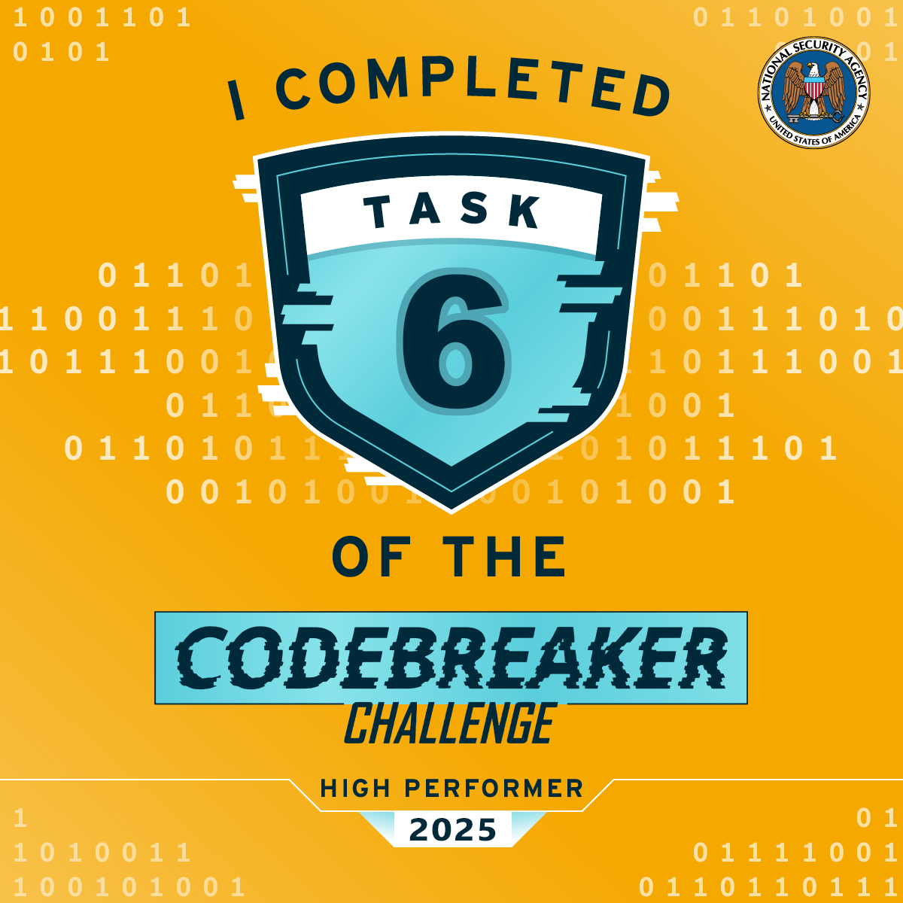

# Task 6 - Crossing the Channel - (Vulnerability Research)

This high visibility investigation has garnered a lot of agency attention. Due to your success, your team has designated you as the lead for the tasks ahead. Partnering with CNO and CYBERCOM mission elements, you work with operations to collect the persistent data associated with the identified Mattermost instance. Our analysts inform us that it was obtained through a one-time opportunity and we must move quickly as this may hold the key to tracking down our adversary! We have managed to create an account but it only granted us access to one channel. The adversary doesn't appear to be in that channel.

We will have to figure out how to get into the same channel as the adversary. If we can gain access to their communications, we may uncover further opportunity.

You are tasked with gaining access to the same channel as the target. The only interface that you have is the chat interface in Mattermost!

## Downloads:

  - [Mattermost instance (volumes.tar.gz)](Downloads/volumes.tar.gz)
  - [User login (user.txt)](Downloads/user.txt)

## Prompt:

    Submit a series of commands, one per line, given to the Mattermost server which will allow you to gain access to a channel with the adversary.

Task Completed at Thu, 01 Jan 2026 23:55:24 GMT: 

---

Awesome job! We can now access the channel and are one step closer to removing this threat.

---

